<link href="./style/markdown.css" rel="stylesheet"></link>

# Advanced Database System

## Content
<!-- TOC -->

- [Advanced Database System](#advanced-database-system)
  - [Content](#content)
  - [Lecture 1 SQL](#lecture-1-sql)
  - [Lecture 2 Relational Algebra](#lecture-2-relational-algebra)
  - [Lecture3 Conjunctive Queries: Syntax and Semantics](#lecture3-conjunctive-queries-syntax-and-semantics)
  - [Lecture4 CQ Evaluation and Static Analysis](#lecture4-cq-evaluation-and-static-analysis)
  - [Lecture5 CQ Minimization](#lecture5-cq-minimization)
  - [Lecture6 CQ Fast Evaluation](#lecture6-cq-fast-evaluation)
  - [Lecture7 HW \& Disk Space Management](#lecture7-hw--disk-space-management)
  - [Lecture8 Buffer Management](#lecture8-buffer-management)

<!-- /TOC -->

## Lecture 1 SQL

1. SQL History
   1. 70s **developed** by IBM (SEQUEL), 80s commercial, 86 ANSI, 87 ISO
   2. Structured Query Language

2. SQL Persistence
   1. 90s: Object-Oriented DBMS (OQL)
   2. 00s: XML (Xquery, Xpath, XSLT)
   3. 10s: NoSQL & MapReduce

3. Pros and Cons
   1. Pros:
      1. Declarative: You tell what you need without considering how to get it
      2. Implemented widely: Vsarying levels of efficiency and completeness (Most DBMS support SQL-92)
      3. Feature-rich: With many added features and extensible to other languages and data resources
   
   2. Cons: 
      1. Constrained: Domain specific, only for data, cannot write a program (Not for Turing-test)

4. Terminology:
   1. Database: set of named relations
   2. Relation: a table
        1. Schema: structure of a relation
            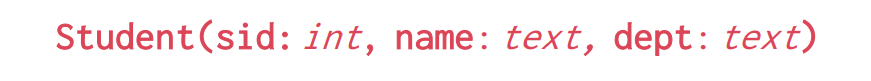
        2. Instance: Collection of data satisfying the schema (a multiset or bag of tuples)
    3. Tuple: a row or record
    4. Attribute: a field or column

5. SQL Language: 
   1. DDL: data definition language, define and modify schema
   2. DML: data manipulation language, write queries intuitively
   3. DCL: Data Control Language, control access to data
   4. RDBMS: select and run algorithms for queries, different choices do not change result

6. Single-table queries
   ```SQL
        SELECT [DISTINCT] <column expression list>
        FROM <single table>
        [WHERE <predicate>]
        [GROUP BY <column list> [HAVING <predicate>]]
        [ORDER BY <column list> [ASC|DESC]] [LIMIT <count> [offset]]
   ```
   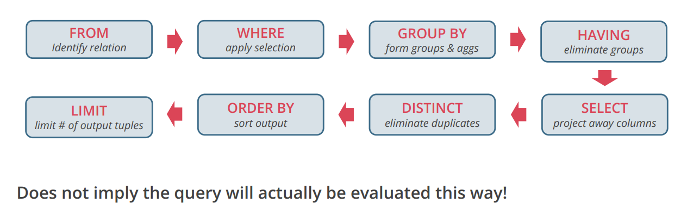

   1. ORDER BY: order by one or more columns, default ASC. ``ORDER BY grade DESC, sid ASC``. ***Otherwise the output is non-deterministic, depend on the alog for query processing***
   2. LIMIT: limit the number of tuples in output relation。 Can set offset to skip first records. ``LIMIT 3 OFFSET 1``
   3. AGGREGATES: use functions to return a summary from a group, including AVG, COUNT, SUM, MIN, MAX. ``SELECT AVG(age) as avg_age. COUNT(sid) as cnt FROM Student``
   4. GROUP BY: patition table into groups with the same GROUP BY column values (can be a list of columns) ``GROUP BY dept, name``
   5. HAVING: similar to where clause, but for filtering a group. ``GROUP BY dept HAVING AVG(age) > 21``

7. Multiple-Table queries
   ```SQL
        SELECT [DISTINCT] <column expression list>
        FROM <table1 [AS t1], table2 [AS t2], ....>
        [WHERE <predicate>]
        [GROUP BY <column list> [HAVING <predicate>]]
        [ORDER BY <column list> [ASC|DESC]] [LIMIT <count> [offset]]
   ```
    1. JOIN QUERY: 
    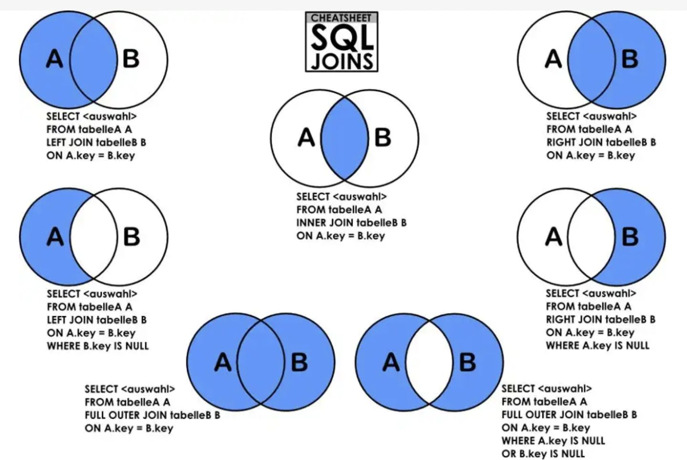
    ```SQL
        SELECT <column list>
        FROM <table>
        [INNER | NATURAL | {LEFT | RIGHT | FULL} OUTER] JOIN
        ON <qualification list>
        where ...
   ```
      1. LEFT/RIGHT (OUTER) JOIN: Return all matched rows and preserve all unmatched rows from the table on the left/right of the join clause, use NULLs in the fields of non-matching tuples. 
      2. FULL OUTER JOIN: Return all matched rows and preserve all unmatched rows with NULLs in unmatched fields. 
      3. INNER JOIN: Return all matched rows. 
      4. NATURAL JOIN: Return rows with same field type and name in two tables. (inner join on columns with same name and type). ***The number of tables with the same name should not >1***

8. Nested queries
   ```SQL
        SELECT S.name FROM Student S
        Where S.sid IN (
            SELECT E.sid FROM Enrolled E
            WHERE E.cid = 'INF-11199'
        )

        SELECT S.name FROM Student S
        Where EXISTS (
            SELECT E.sid FROM Enrolled E
            WHERE E.cid = 'INF-11199'
                AND S.sid = E.sid
        )

   ```

   They are equivelent. 

9. Setcomparison operators:
    1.  IN, NOT IN, EXISTS, NOT EXISTS, op ALL, op ANY (op means =, <>, >, >=, <, <=)
    2.  ALL: must satisfy expression for all rows in subquery
    3.  ANY: must satisfy expression for at least one row in subquery
    4.  IN: equal to '=ANY()'
    5.  NOT IN: equal to '!= ALL()'
    6.  EXISTS: at least one row returned
10. <span style="color: red">QUIZ</span>
    1.  The result of two disjoint relations is equal to their cross product
    2.  DBMS separtes applications from data
    3. 

## Lecture 2 Relational Algebra

1. Query execution overview
    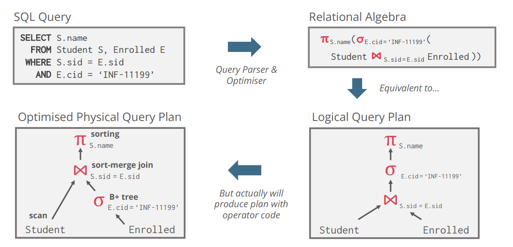
    1. SQL query is the declarative description of computation (about what you want)
    2. RA is the operational description of computation (for system execution)

2. Relational query language
   1. Relational Calculus (basis for SQL): Based on first order logic and describe the result of computation. Tuple Relational Calculus (TRC): 
   $$
      {S | S \in Student \ \ \exist E \in Enrolled\ (S.sid = E.sid \ \cap E.cid = 'INF-11199')}
   $$
   2. Relational Algebra: Operational description of transformations, algebra on sets

3. Codd's theorem: 
   1. Established equivalence in expressivity between **Relational Calculus and Relational Algebra
   2. Connect declarative representation of queries with operational description. It is constructive and we can compile SQL into relational algebra

4. Relational algebra
   1. features: 
      1. Closed: result is also a relation instance, which enables rich composition
      2. Typed: input schema determines output schema, which enables statical check whether queries are legal
    2. Operators: 
       1. &sigma; : Selection, responde to *WHERE* clause. Select a subset of rows that satisfy a selection predicate. ***&sigma; <sub>age=21 &wedge; dept='CS'</sub>(Student)***
       2. &pi; : Projection, respond to *SELECT* clause. Select a subset of columns. ***&pi; <sub>age</sub>(Student)***. Note that set semantic remove duplicates. 
       3. &rho; : Renaming, rename relations and their attributes. Positional arguments are ed in relational algebra. 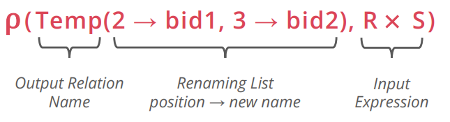
       4. &cup; :  Union, concatenate two relations. They must have same number of fields and fields in the corresponding positions have same type (compatible). *UNION* eliminates duplicates and *UNION All* keeps duplicates. 
       5. &minus; : Set difference, R - S means removing tuples in both of them from R. R and S should be compatible. Respond to *EXCEPT* and *EXCEPT ALL* in SQL. 
       6. &times; : Cross product, R &times; pairs each row of R with each row of S. |R| * |S| rows in the result. If two attributes with same name in the result, leave them unnamed and identify them by position. 
       7. &cap; : Intersection, return the same tuples they share. The input relations should be compatible. respond to *INTERSECT* in SQL. 
       8. $\Join$: Join
            1. Hierarchy: <br>
            Theta Join ($\Join$<sub>&theta;</sub>): join on loogical expression *&theta;*<br>
            &ensp;&ensp;&ensp;&ensp;Equi-Join: theta join with theta being a conjunction of equalities<br>
            &ensp;&ensp;&ensp;&ensp;&ensp;&ensp;&ensp;&ensp;Natural Join ($\Join$): equi-join on all matching column names
            2. Theta-Join example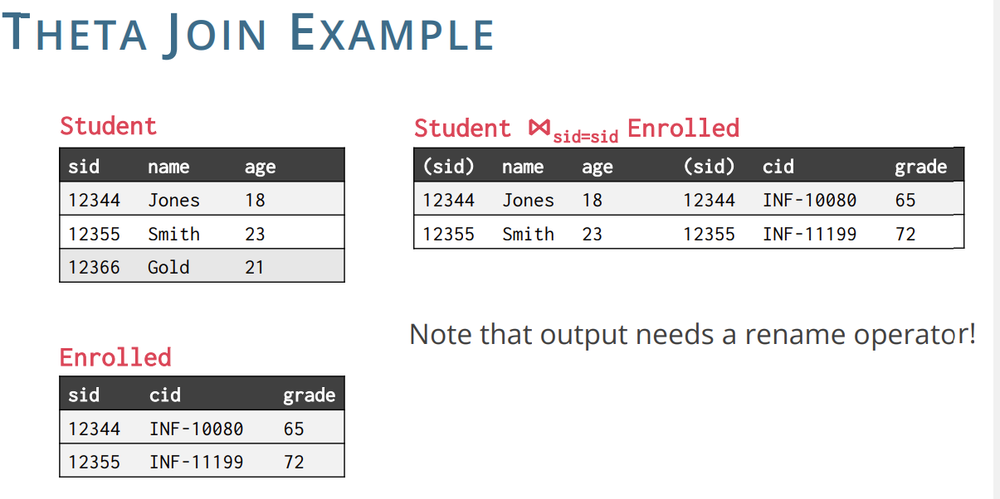
            3. Natural Join: R $\Join$ S = &pi;<sub>unique field</sub>&sigma;<sub>eq.matching field</sub>(R &times; S). Compute R &times; S, select rows where fields appearing in both relaitons have equal values and project onto the set of all unique fields. 
       9. Extra operators: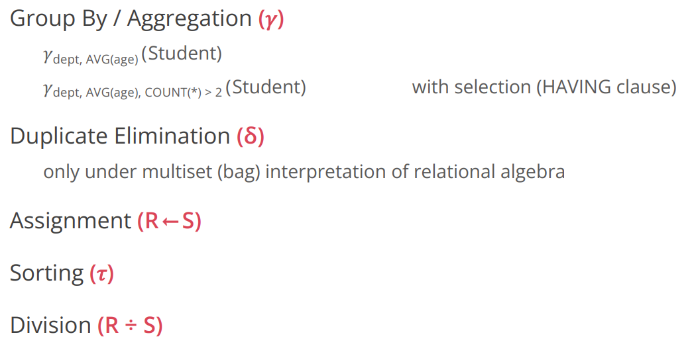

5. Relational algebra and sets
   1. Pure relational algebra has set semantics: no duplicate tuple in a relation instance, but can also be defined over bags (multiset)
   2. SQL has multiset semantics

## Lecture3 Conjunctive Queries: Syntax and Semantics
1. Recap: List the airlines that fly directly from London to Glasgow
   1. Relational Algebra: 
      $$
         \pi _{airline} ((Flight \Join _{origin=code} (\sigma _{city='London'} Airport)) \Join _{destination=code} (\sigma _{city='Glasgow'} Airport))
      $$
   2. Relational Calculus: 
      $$
         \{z\ |\ \exist x \exist y \ (Airport(x, London) \wedge Airport(y, Glasgow) \wedge Flight(x,y,z)))\}
      $$
2. Conjuctive Queries (CQ): 
   1. Equals: 
      1. $\{ \sigma ,\pi, \Join \}$-fragment of relational algebra
      2. relational calculus without $\neg, \forall,\vee,=$
      3. simple SELECT-FROM-WHERE SQL queries (Only AND and equality in the WHERE clause)
   2. Syntax: 
      $Q(x) := \exist y (R_{1}(v_{1}) \wedge ... \wedge R_{m}(v_{m}))$<br>
      1. R are relations
      2. x, y, v are tuples of variables
      3. each variable mentioned in $v_{i}$ appears in x or y
      4. x is called distinguished or output variable
      5. Another form:
         $Q(x) :$- $R_{1}(v_{1}), ... , R_{m}(v_{m})$<br>
         The part after :- is called the <span style="color: red">body</span> of Q, which can be seen as a set of atoms. 
      6. Example: 
         $Q(x) :$- $Airport(x,London), Airport(y,Glasgow),Flight(x,y,z)$<br>

3. Homomorphism: A homomorphism from a set of atoms A to a set of atoms B is a substitution h: terms(A) &rightarrow; terms(B) such that: 
   1. t is a constant value &Rightarrow; h(t) = t
   2. $R(t_{1},...,t_{k}) \in A \Rightarrow h(R(t_{1},...,t_{k})) = R(h(t{1}),...,h(t_{k}))$
   3. where terms(A) = {t | t is a variable or a constant value that occurs in A}
   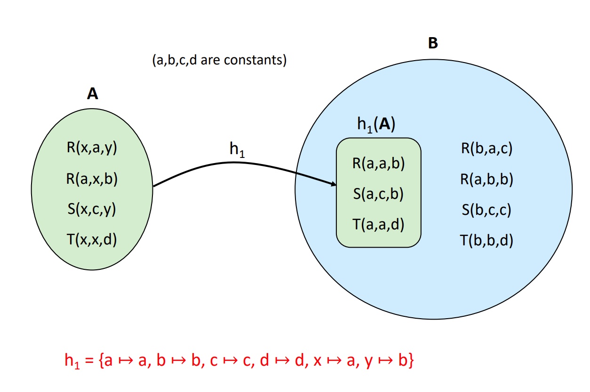

4. Homomorphism compose<br>
   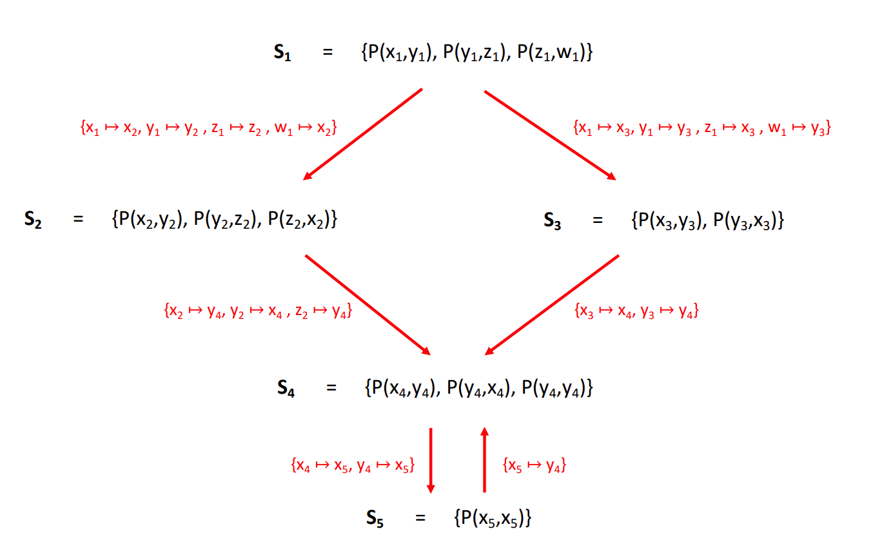
   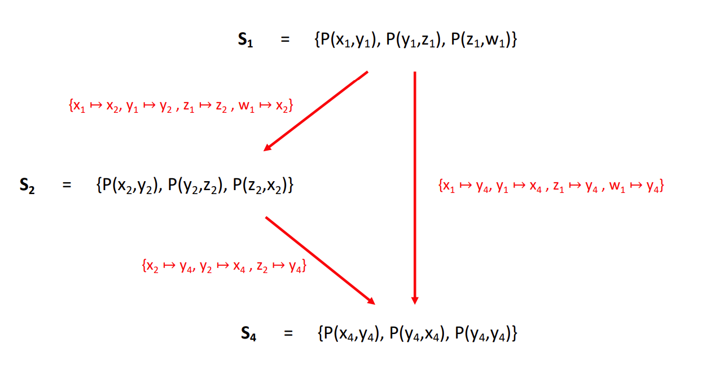
   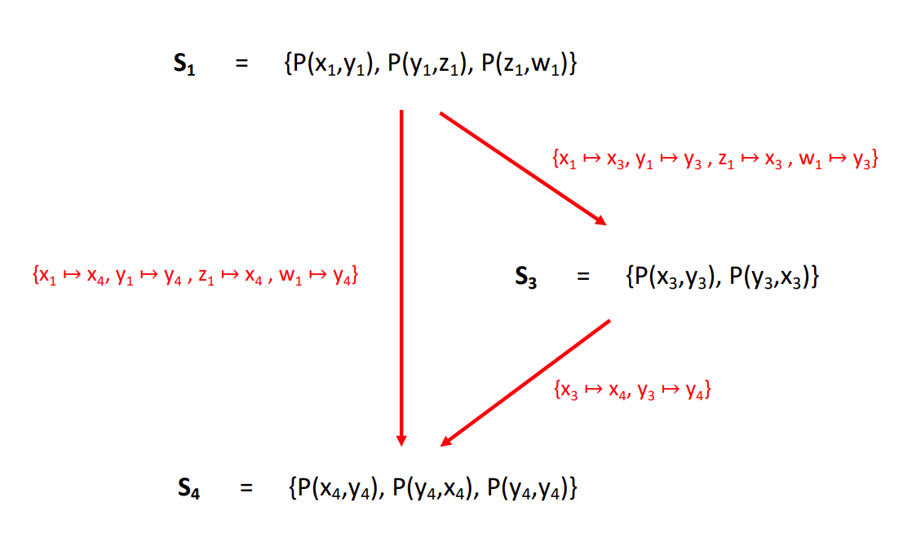

5. Semantics of Conjunctive Queries
   1. A <span style="color: red">match</span> of a CQ in a database <span style="color: green">D</span> is a homomorphism h from the set of atoms <span style="color: brown">body</span> to the set of atoms D
   2. The <span style="color: red">answer</span> to a CQ over <span style="color: green">D</span> is the set of k-tuples $Q(D) := \{(h(x_{1}),...,h(x_{k})) | h\ is\ a\ match\ of\ Q\ in\ D\}$
   3. 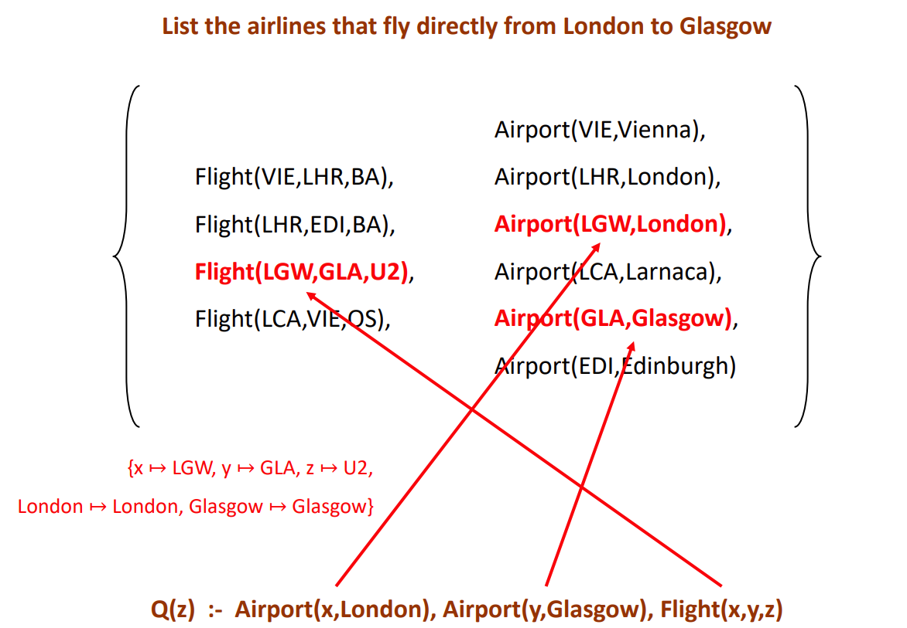


## Lecture4 CQ Evaluation and Static Analysis
1. CQ-Evaluation is NP-complete, and PTIME in data complexity
   1. proof (NP-membership): Guess and check
      1. Consider a database, a CQ and a tuple of values
      2. Guess a substitution h: terms(body) &rightarrow; terms(D)
      3. verify that h is a match of Q in D, i.e., h(body) &subseteq; D and $(h(x_{1}),...,h(x_k)) = (a_{1},...,a_{k})$
   2. NP-hardness: Reduction from 3-colorability
   3. in PTIME: for every substitution h: terms(body) &rightarrow; terms(D), check if h(body) &subseteq; D and $(h(x_{1}),...,h(x_k)) = (a_{1},...,a_{k})$

2. Static analysis
   1. CQ-Satisfiability: 对一个CQ有没有一个能让它非空
   2. CQ-Equivalence: 对Q1和Q2， 是否对于任意D，Q1(D) = Q2(D)
   3. CQ-Containment: 对Q1和Q2， 是否对于任意D，Q1(D) &subseteq; Q2(D)

3. Canonical Database
   1. Convert a CQ into a database D[Q], which  is called, by replacing each variable x with a new value c(x) = x. 
   2. For example, given Q(x,y) :- R(x,y), P(y,z,w), R(z,x), then D[Q] = {R(x,y), P(y,z,w), R(z,x)}
   3. Note: the mapping c: {variables in body} &rightarrow; {new values} is a bijection, where c(body) = D[Q] and c<sup>-1</sup>(D[Q]) = body

4. Theorems
   1. A CQ is always satisfiable: due to its canonical database Q(D[Q]) is trivially non-empty
   2. $Q_{1}\ \subseteq Q_{2}$ iff there is a query homomorphism from Q1 to Q2 (proof see lecture5 p20)
   3. $Q_{1}\ \subseteq Q_{2}\ and\ Q_{2}\ \subseteq Q_{1}\ \Rightarrow Q_{1} = Q_{2}$
   4. CQ-Equivalence and CQ-Containment are NP-complete

## Lecture5 CQ Minimization
1. A CQ Q<sub>1</sub> is <span style="color: red">minimal</span> if there is no CQ Q<sub>2</sub> such that: 
   1. Q<sub>1</sub> &equiv; Q<sub>2</sub>
   2. Q<sub>2</sub> has fewer atoms that Q<sub>1</sub>

2. CQ minimization: To compute a minimal CQ that is equivalent to Q

3. Minimization Procedure: 每次去掉一个能去掉的atom，直到没法去掉为止
   1. 不能去掉distinguished variable
   2. Minimization的结果是唯一的：去掉的顺序不同但是结果是一样的
   3. Minimization的结果被称为the <span style="color: red">core</span> of Q

## Lecture6 CQ Fast Evaluation
1. CQ-Evaluation is NP-Complete, and in PTIME in data complexity: Evaluating Q over D takes time $||D||^{O(||Q||)}$

2. CQ-Evaluation of minimal CQ is NP-hard. 两类CQ query evaluation is trackable:
   1. Graph based: CQs of bounded <span style="color: red">treewidth</span>(measures how close a graph is to a tree)
   2. hypergraph-based: CQs of bounded <span style="color: red">hypertree width</span> (measures how close a hypergraph is to an acyclic one). <span style="color: red">Hypergraph of Acyclic CQs has hypertree width 1</span>
   3. 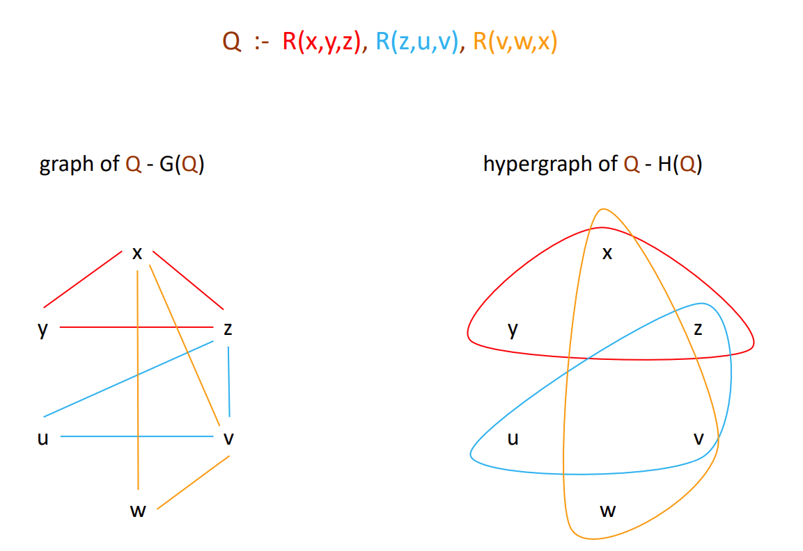

3. Join tree
   1. A <span style="color: red">join tree</span> of a hypergraph H = (V,E) is a labeled tree T = (N,F,L), where L : N &rightarrow; E such that: 
      1. For each hyperedge e &in; E of H, there exists n &in; N such that e = L(n). 对每一个hyperedge有一个对应的tree node
      2. For each node u &in; V of H, the set {n &in; N | u &in; L(n)} induces a connected subtree of T. 对hypergraph里的每个节点，他所出现的所有join tree的node也能组成一个subtree
   2. Ahypergraph is <span style="color: red">acyclic</span> if it has a join tree

4. Checking Acyclicity
   1. <span style="color: red">GYO-reduction</span>
      1. 消除只出现在一个hyperedge的节点
      2. 消除被另一个hyperedge包含的hyperedge
      3. End in an empty graph means it is acyclic: <span style="color: red">A hypergraph H is acyclic iff GYO(H) = &empty; </span>
      4. Checking acyclicity is in PTIME (actually we can check acyclicity in time O(||Q||), <span style="color: red">linear time</span> is the size of Q)
      5. if H(Q) is acyclic, then Q can be evaluated in time O(||D|| &times; ||Q||) <span style="color: red">linear time</span> in the size of D and Q

5. Yannakaki's Algorithm<br>
   Given a database D, and an acyclic Boolean CQ Q: 
   1. Compute the join tree T of H(Q)
   2. Assign to each node of T the corresponding relation of D
   3. Computer semi-joins in a bottom up traversal of T
   4. Return Yes if the resulting relation at the root of T is non-empty, otherwith return NO

## Lecture7 HW & Disk Space Management
1. DBMS connects SQL Clients and Database. SQL clients interact with DBMS and DBMS manages the database. 

2. Architecture of DBMS:. Each layer manages complexity and do performance assumptions.  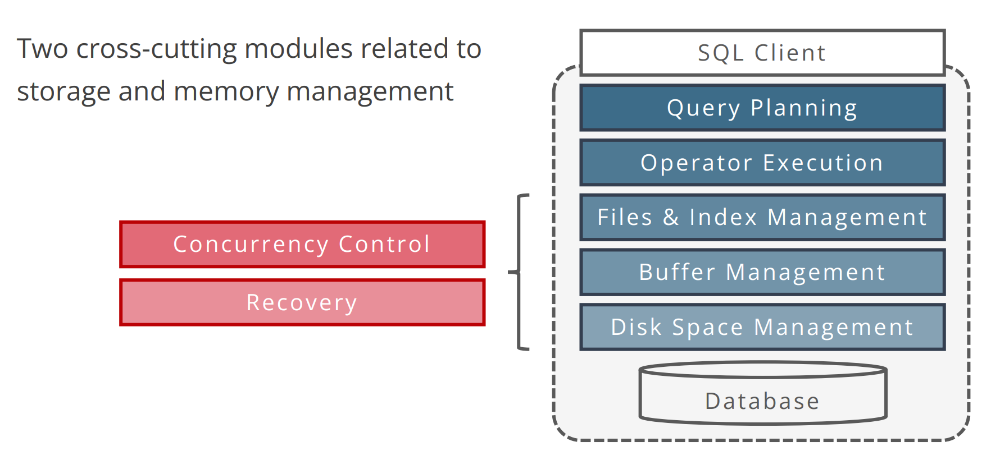 
   1. Query planning: <span style="color: red">Parse</span>, check and verify the SQL query. Translate query into an efficient relational query plan that can be executed. 
   2. Operator Execution: <span style="color: red">Execute</span> a dataflow by operating on <span style="color: red">records and files</span>
   3. Files & Index Management: <span style="color: red">Organise</span> tables and records as groups of pages in a logical file. 
   4. Buffer Management: <span style="color: red">Tranfer</span> data between disk and memory. 
   5. Disk Space management: <span style="color: red">Translate</span> page requests into reading & writing physical bytes on devices. 

3. Disk-Oriented Architecture
   1. 很多DBMS都是为<span style="color: red">non-volatile disk storage</span>设计的. Database存储的位置是disk, 但数据处理是在<span style="color: red">main memory (volatile)</span>. 
   2. Volatile的意思是断电就没了. RAM是volatile, disk不是. 
   3. DBMS需要在disk和main memory中转移数据. 
   4. 对硬盘的读写非常慢, 对主存的很快. 
   5. 主存非常贵, 而且断电失忆, 所以不把数据全放在主存. 但是有一些特定的系统这么干. 

4. Storage Hierarchy (上面的小但快, 下面的慢但大) 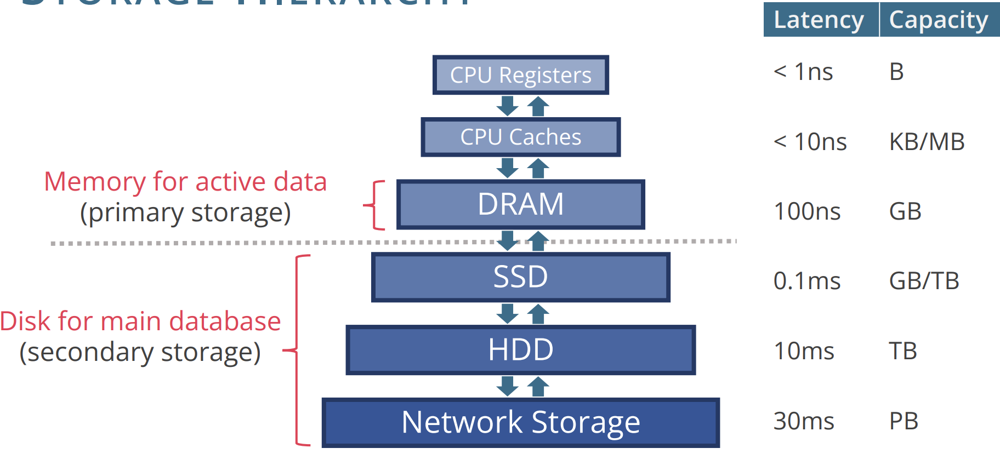
   1. Volatile (Byte-addressable): 
      1. CPU registers
      2. CPU cache
      3. DRAM (<span style="color: red">Memory for active data, 是primary storage</span>)
   2. Non-volatile (block-addressable) (<span style="color: red">用于database存储, 是secondary storage</span>): 
      1. SSD (固态硬盘, solid state drive)
      2. HDD (机械硬盘)
      3. Network Storage

5. How disk works
   1. 一个disk有好几个platter. 读取有个柱子, 柱子有好几个arm, arm有head, head跟platter接触. 读取的时候platter不停地转. 
   2. 同一时间只有一个read/write
   3. platter的一个圆环叫做track, track的一小块叫sector, 几个sector组成block, 不同platter上的同一位置的track组成cylinder
   4. 读取的时候arm动, 把head移到想要的track上. 
   5. sector是最小的存储单元,通常为512Kytes或者4KB

6. Accessing A Disk Page
   1. Data is restored and retrieved in unit called <span style="color: red">disk block</span>. 他的大小由filesystem决定, 通常4KB, 有时候64KB. 
   2. 不像RAM (随机存储), retrieve a block的时间由位置决定. 

7. Time to access a disk block
   1. Seek time: moving disk arm to position disk heads on track
   2. Rotational delay: waiting for target block to rotate under a head
   3. Transfer time: actually moving data to/from disk surface
   4. <span style="color: red">seek time and rotational delay占大部分</span>
   5. Example of accessing 1000 blocks of size 8KB
      1. Random: 1000 &times; 5.45ms = 5.45s
      2. Sequential: 3.4ms + 2ms + 1000 &times; 0.05ms = 55ms

8. Arranging Blocks on Disk
   1. **Next** block: sequential blocks on same track , followed by blocks on same cylinder, followed by blocks on adjacent cylinder
   2. Arrange file pages sequentially by **next** on disk can minimize seek and rotational delay. 
   3. For a sequential scan, pre-fetch several blocks at a time. 

9. SSD (Solid State Drive)
   1.  An alternative to conventional hard disks: data are accessed in pages, internally pages are organised into blocks. <span style="color: red">Fine-grain reads (4-8KB pages) and coarse-grain writes (1-2MB blocks)</span>
   2.  Issues in current generation (NAND): 
       1.  write amplification: 将数据写入小的pages可能会导致抹除big blocks
       2.  Limited Endurance: Only 2K-3K erasures before cell failure
       3.  Wear levelling: SSD controller needs to keep moving hot write units around
       4.  Price: SSD比HDD贵-5倍
   3. Read is fast and predictable: 
      1. Single read access time 30微秒
      2. 4KB random reads: 约500MB每秒
      3. sequential reads: 约525MB每秒
   4. 写得比较慢
      1. Single write access time: 30微秒
      2. 4KB random writes: 约120MB每秒
      3. Sequential writes: 约480MB每秒

10. SSD vs HDD
    1.  SDD可以达到1-10倍的速度对比理想的HDD, 且HDD的理想状态很难达到
    2.  对较远的blocks的读写非常慢
    3.  SDD比HDD贵好多

11. Database storage
    1.  大多数DBMS将data存储在disk上的一个或多个files
    2.  files由<span style="color: red">pages (loaded in memory)</span>, pages contain <span style="color: red">records</span>. 
    3.  Data on disk is read & written in large chunks of sequential bytes. 
        1.  Block: Unit of transfer for disk read/write
        2.  Page = A common synonym for block
   Sequential pages: reading next page is fastest

12. Disk Space Management
    1.  Lowest lower of DBMS, manages space on disk: 
          1.  map pages to locations on disk
          2.  load pages from disk to memory
          3.  save pages back to disk
    2. Introduces the concept of pages
       1. Typical page size; 4-64KB, amultiple of 4KB
       2. Each page has unique identifier: <span style="color: red">page id</span>
       3. higher levels call upon this layer to: 
            1. Allocate/de-allocate a page
            2. Read/write a page
    3. Page requests
       1. Disk space manager can get requests for a <span style="color: red">sequence of pages</span>, e.g. when higher levels execute a scan operator on a relation
       2. Such requests are best satisfied by pages stored sequentially on disk
            1. Physical details are hidden from higher levels
            2. higher levels can safel <span style="color: red">next page is fast</span>, so they expect sequential runs of pages to be quick to scan. 
            3. Disk space manager aims to intelligently lay out data on disk, to meet the performance expection of higher levels as best as possible. 
    4. Implementation
         1. Using local filesystem
         2. Allocate one large "contiguous" file on an empty disk
         3. Rely on OS and FS that sequential pages in this file are physically contiguous on disk
         4. A logical database file may span multiple FS files on multiple disks/machines
         5. Disk space manager maintains a mapping from page IDs to physical locations (<span style="color: red">physical location = filename + offset within the file</span>)
         6. The OS and other apps know nothing about the contents of the files: 
            1. Only the DBMS knows how to decipher their contents
            2. Early DBMSs in the 1980s used cunstom filesystems on raw storage

## Lecture8 Buffer Management
1. The second deepest layer in DBMS, transfers data bwtween disk (Database file) and memory (buffer pool). 

2. Buffer pool: in-memory cache of disk pages, partitioned into <span style="color: red">frames</span>, each frame holds a page. Higher level can either request (<span style="color: red">pin</span>) a page and release (<span style="color: red">unpin</span>) a page. 

3. Page Request: 
   1. Ensures requested page is in memory upon return. 
   2. Higher levels need not to worry about whether data is in memory or not. 
   3. Buffer pool sends pointer to the requested page to the execution engine and engine gets page into the buffer pool. 

4. Page Release: 
   1. Higher levels need to explicitly release a page. 
   2. A page can be simultabeously used by multiple pages. 
   3. If nobody is using a page at the moment, that page <span style="color: red">can</span> be removed from the pool, <span style="color: red">but does not have to be removed immediately. </span>

5. Some questions
   1. If buffer pool is full, we use a <span style="color: red">replacement policy</span> to decide which page to evict. 
   2. we use <span style="color: red">dirty flags</span> to indicate if a page is modified. When evicting a page, <span style="color: red">write it back to disk via disk space management</span>. 
   3. We use <span style="color: red">pin counter</span> to count the number of concurrent users of the page. <span style="color: red">If pin count = 0, then the page is a condidate for replacement</span>. 

6. Buffer Manager State
   1. Buffer Pool: 在服务器启动时 (DBMS server boot time)分配的一大块内存, 大小为 MB-GB. 
   2. Buffer manager metadata: 在服务器启动时分配的一小个数组, 存储in-memory index (hash table) on PageID. 

7. Pin/Unpin
   1. Database users must properly bracket any page operation with <span style="color: red">pin</span> and <span style="color: red">unpin</span>. 
   2. Proper bracketing useful to keep a count of active suers of page (Example of a read-only transaction)
   ```
   a = pin(pageNo)
   ... # read data on page at memory address a
   unpin(pageNo, false)
   ```
   3. Pin implementation
   ```
   if buffer pool already contains pageno then
      f = find frame containing pageno
      f.pinCount = f.pinCount + 1
      return address of frame f
   else 
      f = select a free frame if buffer is not full or a victim frame using replacement policy (f.pinCount = 0)
      if f.isDirty then
         write frame f to disk
      read page pageno from disk into frame f
      f.pinCount = 1
      f.isDirty = false
      return address of frame f
   ```
   4. Unpin implementation
   ```
   f = find frame containing pageno
   f.pinCount = f.pinCount - 1
   f.isDirty = f.isDirty || dirty
   ```
   Proper bracketing ensures that the pageno we want to unpin is in the buffer pool. 
   Multiple users may be using the page, so we do not write the page back in unpin. 

8. Concurrency Control Module: Solves concurrent operations in page, before the page is unpinned. Buffer manager may assume everything is in order whenever it gets an unpin(p, true) call.  
   1. The same page p is requested by more than one transaction. 
   2. Those transactions perform <span style="color: red">conflicting writes</span> on p. 

9. Recovery module: Solves system crashes before write-back. 

10. Buffer replacement policy: 
       1. Common replacement policies (have big effect on the number of I/Os): 
          1. Leastly Recently Used (LRU)
          2. Clock
          3. Mostly Recently Used (MRU)
          4. Other: Random, Toss-Immediate, FIFO, LRU-K
      2.  LRU (very common, intuitive and simple): 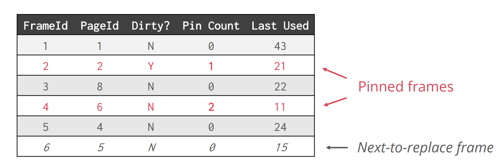 
          1. 追踪每个frame最后一次结束时用的时间 (last unpinned). 替换最早结束使用的frame (lowest last used time). Pinned frames are not available to replece. 
          2. Good for repeated accesses to popular pages, because unopular pages accessed a while age are more likely to be replaced. 
          3. Can be <span style="color: red">costly</span>, because need to find min in the last used attribute: 
             1. Naive (<span style="color: red">linear time</span>): Scan the table to find min. 
             2. Better (<span style="color: red">log time</span>): Use priority queues to keep frames in sorted order. <span style="color: red">It can also be expensive as page accesses are frequent. </span>
       3. Clock policy (Approximate LRU)
          1. Each frame has a <span style="color: red">reference bit</span>. Set referenced = 1 when pin count increases. 
          2. Frames are arranged in a circular buffer with a clock hand (which means the next page to consider for eviction)
          3. Implementation (invoked when the pull is full and we need to evict a page)

         While victim is not found: 
            if frames[hand].pinCount == 0 then
               if frame[hand].referenced == 1 then
                  frames[hand].referneced = 0
               else
                  victim = address of frames[hand]
            hand = (hand + 1) mod N
       4. LRU and CLOCK are susceptible to <span style="color: red">sequential flooding</span>. For scans, the most recently used page is the most <span style="color: red">unneeded</span> page. For example, buffer pool has 6 frames but a relation has 7 pages, 要page7的时候替换掉了page1, 但是接下来就需要page1, 又替换掉page2......
       5. MRU: 替换most recently used page. 
        6. Pros and Cons: 
          1. LRU suffers from sequential flooding, but good for random access (<span style="color: red">LRU-K variant</span> consider the history of the last K references and evict the page whose k-th most recent access is furthest away in the past)
          2. MRU better fit for repeated sequential scans (repeated scans are very common in database workloads, e.g. nested-loops join)
          3. Hybrids are not uncommon in modern DBMS (PostgreSQL uses CLOCK but handles sequential scans separately)

