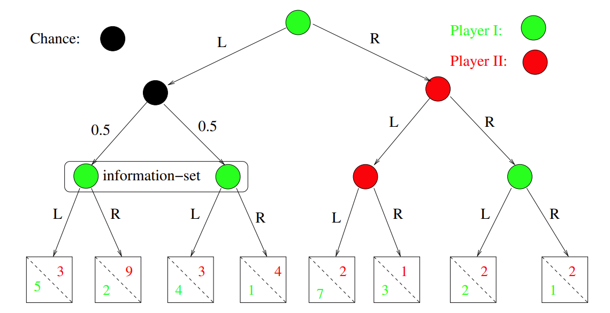

<link href="./style/markdown.css" ref="stylesheet"></link>

# Algorithmic Game Theory and Applications

## Content
<!-- TOC -->

- [Algorithmic Game Theory and Applications](#algorithmic-game-theory-and-applications)
  - [Content](#content)
  - [Lecture 1 What is game theory](#lecture-1-what-is-game-theory)
  - [Lecture 2 Mixed Strategies, Expected Payoffs, and Nash Equibrium](#lecture-2-mixed-strategies-expected-payoffs-and-nash-equibrium)
  - [Lecture4 2-player zero-sum games, and the minimax Theorem](#lecture4-2-player-zero-sum-games-and-the-minimax-theorem)
  - [Lecture5 Introduction to Linear Programming](#lecture5-introduction-to-linear-programming)
  - [Lecture6 The Simplex Algorithm](#lecture6-the-simplex-algorithm)
  - [Lecture7 LP Duality Theorem](#lecture7-lp-duality-theorem)
  - [Lecture8 Dominance and iterated strategy elimination](#lecture8-dominance-and-iterated-strategy-elimination)
  - [Lecture9 Computing NE](#lecture9-computing-ne)

<!-- /TOC -->
## Lecture 1 What is game theory

1. Dominant Strategy: No matter what other players do, it is the optimal strategy. For example in Prisoner's dilemma, defection is the dominant strategy. 
   
2. Nash Equibria: A profile of stratefies for n players such that no player can benefit by <u>unilaterally</u> deviating from its strategy. E.g., in prisoner's dilemma (defect, defect) is a <u>pure</u> NE. In Rock-Paper-Scissors ((1/3, 1/3, 1/3), (1/3, 1/3, 1/3)) is a <u>mixed</U> NE. 
   
3. Game types: 
   1. Strategic game: All players make decisions <u>simultaneously</u>, without knowing other players' decisions
   2. Extensive game: Players make decisions <u>sequentially</u> with knowledge about others' previous decisions. Extensive game can be represented by a tree. 

4. Chance and Information
   1. Some nodes in a tree can be <u>chance</u> nodes (probabilistic). 
   2. Not all information can be available to a player. A player employs a move at a node in a <u>information set</u>. 
   3. A game where every information set has only one node is called a game with <u>perfect information</u>

5. Theorem about extensive game: Any finite n-person extensive game of perfect information has an equibrium in pure strategies. 

6. Mechanism design
   1. Auctions:
      1. Ascending-bid auctions (English auctions): The seller gradually raises the price. Bidders drop out and the last bidder wing the object at this final price. 
      2. Descending-bid auctions (Dutch auctions): The seller lowers the price from a high initial price until some bidder accepts and pays the current price. 
      3. First-price sealed-bid auctions: Bidders submit sealed bids simultaneously and the highest bidder wins and pays the value of his bid. 
      4. Second-price sealed-bid auctions (Vickrey auctions): Submit simultaneously and the highest bidder wins, but pays the second highest price. 

7. Applications
   1. Games in AI: modeling "rational agents" and their interactions. 
   2. Games in Modeling and analysis of reactive systems: computer-aided verification. 
   3. Games in Algorithms: several GT problems have a very interestion algiorithmic status. 
   4. Games in Logic in CS: GT characterizations of logics, including modal and temporal logics. 
   5. Games in Computational Complexity: Many computational complexity classes are definable in terms oof games. 
   6. Games, the Internet and E-commerce. 

## Lecture 2 Mixed Strategies, Expected Payoffs, and Nash Equibrium

1. A <u>finite</u> strategic game consists of: 
   1. A set N = {1,...,n} players
   2. For each i &in; N, a finite set S<sub>i</sub> = {1,...,m<sub>i</sub>} of (pure) strategies. S = S<sub>1</sub> &times; S<sub>2</sub> &times; ... &times; S<sub>n</sub> be the set of possible combinations of (pure) strategies. 
   3. For each i &in; N, a payoff (utility) function: u<sub>i</sub> : S &mapsto; &real;, describes the payoff u<sub>i</sub>(s<sub>1</sub>,...,s<sub>n</sub>) to player i under each combination of strategies. 
   4. The key assumption is that each player wants to maximize its own payoff. 

2. Mixed (Randomized) strategies: 
   1. the probability distribution over all pure strategies. For strategies S = {1,...,m<sub>j</sub>}, x<sub>i</sub>(m<sub>j</sub>) denotes the probability of player i taking strategy m<sub>j</sub>. &Sigma;<sup>j</sup> x<sub>i</sub>(m<sub>j</sub>) = 1. 
   2. Let X<sub>i</sub> be the set of mixed strategies for player i. For an n-player game, X = X<sub>1</sub> &times; ... &times; X<sub>n</sub>, denote the set of all possible combinations, or <u>**profiles**</u> of mixed strategies. 

3. Expected payoffs
   1. The expected of a player i is U<sub>i</sub>(x) := &Sigma;<sub>s&in;S</sub> X(s) * u<sub>i</sub>(s), the weighted average of payoff for each strategy over its probability. 

4. Some notations
   1. Given a mixed strategy x = ( x<sub>1</sub>,...,x<sub>n</sub>) &in; X, let x<sub>-i</sub> = (x<sub>1</sub> , ... , x<sub>i-1</sub> ,empty, x<sub>i+1</sub> , ... , x<sub>n</sub> )
   2. (x<sub>-i</sub> ; y<sub>i</sub>) is the new profile where others' strategies remain the same while the i-th player change his strategy to y<sub>i</sub>

5. Best response: the best response z<sub>i</sub> of player i to other players' strategies, U<sub>i</sub> ( x<sub>-i</sub> ; z<sub>i</sub> ) &geq; U<sub>i</sub> ( x<sub>-i</sub> ; y<sub>i</sub> ). If every player employs best response, it is a NE. If every best response is a pure strategy, it is a pure NE. 

6. Nash's theorem: Every finite n-person strategic game has a mixed Nash Equilibrium. 

7. Brouwer fixed point theorem: Every continuous function f : D &rightarrow; D mapping a <u>compact</u> and <u>convex</u>, nonempty subset D &subseteq; &real;<sup>m</sup> to iteslf has a "fixed point", i.e., there is a x<sup>\*</sup> &in; D such that f(x<sup>\*</sup>) = x<sup>\*</sup>

8. Prove (see Lecture3 page4)

9. Pareto optimal (Pareto efficient): Cannot improve any player's payoff without hurting others' payoff. A profile is x &in; X is **pareto efficient** if there is no other x' such that U<sub>i</sub>(x) &leq; U<sub>i</sub>(x') for all player i, and U<sub>k</sub>(x) < U<sub>k</sub>(x') for some player k. 

10. Evolution helps arrive a NE. As a result, a mixed strategy can be viewed as percentages in a population that exhibit different behaviors. 

11. Symmetric game: all players can take the same actions and for all s<sub>1</sub>,s<sub>2</sub> &in; S, u<sub>1</sub>(s<sub>1</sub>,s<sub>2</sub>) = u<sub>2</sub>(s<sub>2</sub>,s<sub>1</sub>)

11. Evolutionarily Stable Strategy (ESS): a mixed strategy x<sub>1</sub>\* is an ESS, if:
    1.  x<sub>1</sub>\* is a best response to itself, i.e., x\* = (x<sub>1</sub>\*, x<sub>1</sub>\*) is a symmetric NE, and
    2.  If x<sub>1</sub>' $\neq$ x<sub>1</sub>\* is another best response to x<sub>1</sub>\*, then U<sub>1</sub>(x<sub>1</sub>', x<sub>1</sub>') < U<sub>1</sub>(x<sub>1</sub>\*, x<sub>1</sub>')
    3.  Every sysmmetric game has a symmetric NE, (x<sub>1</sub>\*, x<sub>1</sub>\*), but not every symmetric game has a ESS. 
    4.  Examples: 
        1.  In Hawk-Dove game, (5/8, 3/8) is a NE and ESS
        2.  In Rock-Paper-Scissors, (1/3, 1/3, 1/3) is a NE but not a ESS. 
    5. Finding a ESS is NP-hard and coNP-hard

## Lecture4 2-player zero-sum games, and the minimax Theorem
1. 2-person zero-sum games: 
   1. 对任意一个profile两个player的payoff相加等于0。
   2. player1可以采用m<sub>1</sub>个strategy， player2可以采用m<sub>2</sub>个strategy，则    player i的payoff可以用一个m<sub>1</sub> &times; m<sub>2</sub>的矩阵来表示。
      $$A_{1}=\begin{bmatrix}
         u_{1}(1,1)&......&u_{1}(1,m_{2})\\
         \vdots&\vdots&\vdots\\
         \vdots&\vdots&\vdots\\
         u_{1}(m_{1},1)&......&u_{1}(m_{1},m_{2})
      \end{bmatrix}$$
   3. A<sub>2</sub> = -A<sub>1</sub>. Then we assume u(s<sub>1</sub>, s<sub>2</sub>) is given <u>as one matrix</u>, A = A<sub>1</sub>. 
   4. Thus, a 2-player zero-sumgame can be described by a single m<sub>1</sub> &times; m<sub>2</sub> matrix, where a<sub>i , j</sub> = u<sub>1</sub>(i, j)
      $$A=\begin{bmatrix}
         a_{1,1}&......&a_{1,m_{2}}\\
         \vdots&\vdots&\vdots\\
         \vdots&\vdots&\vdots\\
         a_{m_{1},1}&......&a_{m_{1},m_{2}}
      \end{bmatrix}$$
   5. Player 1 wants to maximize u(i, j) whereas Player 2 wants to minimize it (cause negative)

2. Notation of matrix and vector
   1. A > B: 每个值都比他大
   2. 矩阵满足乘法结合律，但是不满足交换律
   3. 矩阵转置(transpose): (B<sup>T</sup>)<sub> i, j</sub> = B<sub> j, i</sub>

3. Matrix view of zero-sum game
   1. 每一个mixed strategy都用一个column vector表示。
   2. x<sub>1</sub><sup>T</sup>Ax<sub>2</sub> = U<sub>1</sub>(x) = - U<sub>2</sub>(x)

4. minmaximizing strategies: 在对方最大化自己payoff的基础上最大化自己的payoff, 也就是让自己的最小收入最大化

5. Minimax theorem(冯诺依曼的)：对于一个2p-zs game, 存在一个唯一的值v\*, 对于x\* = (x<sub>1</sub>\*, x<sub>2</sub>\*) &in; X, 满足：
   1. ((x<sub>1</sub>\*)<sup>T</sup>A)<sub>j</sub> &geq; v\*, for j = 1,...,m<sub>2</sub>
   2. (Ax<sub>2</sub>\*)<sub>j</sub> &leq; v\*, for j = 1,...,m<sub>1</sub>
   3. Thus, v* = (x<sub>1</sub>\*)<sup>T</sup>Ax<sub>2</sub>\*, and 
      $$
         max_{x_{1}\in X_{1}}min_{x_{2}\in X_{2}} (x_{1})^TAx_{2} = v^* = min_{x_{2}\in X_{2}}max_{x_{1}\in X_{1}} (x_{1})^TAx_{2}
      $$
   4. In face, the above conditions hold when $x^* = (x_{1}^*, x_{2}^*)$ is a NE. $x_{1}^*$ is and minmaximizer and $x_{2}^*$ is a maxminimizer. 
   5. 也就是说，$x_{1}^*$保证了Player1最少获得$v^*$的payoff。 $x_{2}^*$保证了Player2最多损失$v^*$
   6. $x^*$ = ($x_{1}^*$, $x_{2}^*$)被称为**minimax profile**
   7. $v^*$被称为**minimax value**
   8. Obviously, Player1的最大payoff &leq; Player2的最大损失

6. Minimax theorem的证明(see Lecture4 p11)。

7. We deal we minimax as an optimization problem
   1. **Maximize** v
   2. **Subject to constraints**:
      1. $(x_{1}^TA)_{j} \geq v for j = 1, ... , m_{2}$
      2. $x_{1}(1) + ... + x_{1}(m_{1}) = 1$
      3. $x_{1}(j) \geq 0 for j = 1, ... , m_{1}$
   3. The optimal solution $(x_{1}^*, v^*)$ will give the minimax value $v^*$, and a minimaximizer $x_{1}^*$ for Player1

## Lecture5 Introduction to Linear Programming
1. A linear program is defined by three parts:
   1. A <u>linear objective function</u>
   2. An <u>optimization criteria</u>, maximize or minimize
   3. A set of m <u>linear constraints</u> or <u>linear inequilities/equalities</u>. 
   4. K(C) 就是所有constraint的交集。K(C) not empty就是有解，就说C is feasible.

2. 可能的情况:
   1. K(C)是空的
   2. 没有上界，但是你要maximize
   3. 找到了optimal solution，这个解一定是有理数解

## Lecture6 The Simplex Algorithm
1. Geometric idea of Simplex: 在feasible area随机选一个顶点，然后沿着edge换到一个能让结果变好的neighbour vertex
   ```
      While (x has a "neighbour vertex", x', with f(x') > f(x)):
         Pick such a neightbor x'. Let x := x'
         (If the "neighbor" is at "infinity", outpout "Unbounded")
   ```
   Note: 不会stuck in local optimal，因为 K(C) is convex. <span style="color: red">On a convex region, a "local optimum" of a linear objective is always a "global optimum"</span>

2. Slack Variables: By adding a slack variable y<sub>i</sub> to each inequality, we get an equivalent LP with only <span style="color: red">equalities</span>. LP in this form is called a <u>dictionary</u>: 
   $$
   Maximize\\ c_{1}x_{1}\ +\ c_{2}x_{2}\ +\ ...\ +\ c_{n}x_{n}\ +\ d\ \\
   Subject\ to: \\
      a_{1,1}x_{1}\ +\ a_{1,2}x_{2}\ +\ ...\ +\ a_{1,n}x_{n}\ +\ y_{1}\ =\ b_{1} \\
      a_{2,1}x_{1}\ +\ a_{2,2}x_{2}\ +\ ...\ +\ a_{2,n}x_{n}\ +\ y_{2}\ =\ b_{2} \\
      ... \\
      a_{m,1}x_{1}\ +\ a_{m,2}x_{2}\ +\ ...\ +\ a_{m,n}x_{n}\ +\ y_{m}\ =\ b_{m} \\

      x_{1},\ ...\ ,\ x_{n} \geq 0;\ y_{1},\ ...\ ,\ y_{m}\ \geq 0
   $$
   1. Every equality constraint has at least one variable with coefficient 1 that doesn't appear in any other equality
   2. Picking one such variable, y<sub>i</sub>, for each equality, we obtain a set of m variables B = {$y_{1},\ ...\ ,\ y_{m}$} called a ***<u>Basis</u>***
   3. Objective f(x) involves only non-Basis variables
   4. This is a dictionary

3. Basic Feasible Solutions (BFS): Rewrite the LP as
   $$
   Maximize\\ c_{1}x_{1}\ +\ c_{2}x_{2}\ +\ ...\ +\ c_{n}x_{n}\ +\ d\ \\
   Subject\ to: \\
      x_{n+1}\ =\ b_{1}\ -\ a_{1,1}x_{1}\ -\ a_{1,2}x_{2}\ -\ ...\ -\ a_{1,n}x_{n}\  \\
      x_{n+2}\ =\ b_{2}\ -\ a_{2,1}x_{1}\ -\ a_{2,2}x_{2}\ -\ ...\ -\ a_{2,n}x_{n}\  \\
      ... \\
      x_{n+m}\ =\ b_{m}\ -\ a_{m,1}x_{1}\ -\ a_{m,2}x_{2}\ -\ ...\ -\ a_{m,n}x_{n}\  \\

      x_{1},\ ...\ ,\ x_{n+m} \geq 0
   $$
   1. This is a <u>feasible dictionary</u>. (y<sub>i</sub> = x<sub>n+i</sub> = b<sub>i</sub>)
   2. We then have a feasible solution by letting x<sub>i</sub> := 0 for i = 1, ..., n
   3. Then the objective value is f(0) = d
   4. This is a <u>BFS</u>, with basis B (different Bases B may yield the same BFS)
   5. A BFS corresponds to a <u>vertex</u>

4. Pivoting
   1. Current feasible dictionary is B = {$x_{i_{1}},\ ...\ ,\ x_{i_{m}}$}, with $x_{i_{r}}$ is the variable on the left of constraint r. 
   2. Pivoting is to add x<sub>j</sub> and remove x<sub>i<sub>r</sub></sub> from basis B. 
      1. Assuming C<sub>r</sub> involves x<sub>j</sub>, rewrite C<sub>r</sub> as x<sub>j</sub> = &alpha; (一个xj的表达式)
      2. 把x<sub>j</sub>的表达式带入到其他有x<sub>j</sub>的constraint $C_{l}$中，得到$C_{l}'$
      3. The new constraint C', have a new basis B' := (B \ {$x_{i_{r}}$}) &cup; {$x_{j}$}. 
      4. Substitute &alpha; for $x_{j}$ in f(x), so that f(x) again only depends on variables not in the new basis B' (which is a possible neighbor of B). However, not every such basus B' is eligible. 

5. Sanity check for pivoting (eligibility)
   1. The new constraint $b_{i}'$ remain &geq; 0, so we retain a "feasible dictionary", and thus B' yields a BFS. 
   2. The new BFS must improve, or at least must not decrease, the value d' = f(0) of the new objective function. (all non-basic variables are set to 0 in a BFS. f(BFS) = f(0))
   3. (a) Suppose all variables in f(x) have negative coefficients. Then any increase from 0 in these variables will decrease the objective. We are then at an optimal BFS x\* <br>
      (b) Suppose a variable $x_{j}$ in f(x) has coefficient $c_{j}$ > 0, and coefficient of $x_{j}$ in every constraint C<sub>r</sub> is &geq; 0. Then we can increase $x_{j}$ and objective to infinity, without violating the constraints. So it is unbounded. 

6. Dantzig's <u>Simplex algorithm</u>:
   1. Check if we are at an optimal solution. If so, output the solution
   2. Check i infinity neighbor. If so, output unbounded. 
   3. Otherwise, choose an eligible pivot pair of variables, and Pivot

7. Problem and solution: we can cycle back to the same basis forever, never strictly improving by pivoting. Solutions include:
   1. Choose rules for pivoting. For example, <u>Bland's rule</u>: For all eligible pivot pairs (xi, xj), where xi is being added to the basis and xj is being removed, choose the pair such that, first, i is as small as possible, and second, j is as small as possible. 
   2. Choose randomly among eligible pivots. You will definitely get out. 
   3. Penturb the constraints slightly to make the LP "non-degenerate". (implement this using, e.g., the "lexicographic method")

8. Checking feasibility via simplex
   $$
   Maximize\\ -x_{0}\ \\
   Subject\ to: \\
      a_{1,1}x_{1}\ +\ a_{1,2}x_{2}\ +\ ...\ +\ a_{1,n}x_{n}\ -\ x_{0}\ \leq \ b_{1} \\
      a_{2,1}x_{1}\ +\ a_{2,2}x_{2}\ +\ ...\ +\ a_{2,n}x_{n}\ +\ x_{0}\ \leq \ b_{2} \\
      ... \\
      a_{m,1}x_{1}\ +\ a_{m,2}x_{2}\ +\ ...\ +\ a_{m,n}x_{n}\ +\ x_{0}\ \leq \ b_{m} \\

      x_{0},\ ...\ ,\ x_{n} \geq 0;
   $$
   1. This LP is feasible: let $x_{0}$ = -min{$b_{1},...,b_{m},0$}, x<sub>j</sub> = 0, for j = 1, ... , n. We can also get a feasible dictionary, and thus initial BFS, for it by adding slack variables. 
   2. The original LP is feasible if and only if in an optimal solution to the new LP, $x_{0}^*$ = 0

9. Complexity
   1.  Each pivoting iteration can be performed in O(mn) arithmetic operations. Also, coefficients stay polynomial-sized, as long as retional coefficients are kept in reduced form (e.g., removing common factors from numerator and denominator). So, each pivot can be done in "<u>polynomial time</u>"
   2.  How many iterations are required to reach the optimal solution? Can be exponentially many. 
   3.  The worst case that force exponentially many iterations (e.g., Klee-Minty(1972)). But very efficient in practive, requiring O(m) pivots on typical examples. 

10. Whether exist a pivoting rule that achieves polynomially many pivots on all LPs? 
    1.  A randomized pivoting rule is known that requires $m^{O(\sqrt{n})}$ expected pivots. 
    2.  In every LP, is there a polynomial-length path via edges from every vertex to every other? The best known bound is $\leq m^{O(log_{n})}$
    3.  Khachian'79 proved LP has a polynomial time algorithm, using a completely different appraoch, <span style="color: red">The "Ellopsoid Algorithm"</span>. It is theoretically important but not practical. 
    4.  Karmarkar'84 gave a algorithm using <span style="color: red">the interior-point method</span>. 

## Lecture7 LP Duality Theorem
1. Matrix notation of LP
   1. Primal Form
   $$
   Maximize: c_{1}x_{1}\ +\ c_{2}x_{2}\ +\ ...\ +\ c_{n}x_{n}\\   
   Subject\ to: \\
      a_{1,1}x_{1}\ +\ a_{1,2}x_{2}\ +\ ...\ +\ a_{1,n}x_{n}\ \leq \ b_{1} \\
      a_{2,1}x_{1}\ +\ a_{2,2}x_{2}\ +\ ...\ +\ a_{2,n}x_{n}\ \leq \ b_{2} \\
      ... \\
      a_{m,1}x_{1}\ +\ a_{m,2}x_{2}\ +\ ...\ +\ a_{m,n}x_{n}\ \leq \ b_{m} \\

      x_{1},\ ...\ ,\ x_{n} \geq 0
   $$
   2. By defining:
   $$
   (m\times n)matrix\ A:\ (A)_{i,j}\ =\ a_{i.j}\\
   x = [x_{1},\ ...\ ,\ x_{n}]^{T}\\
   b = [b_{1},\ ...\ ,\ b_{m}]^{T}\\
   x = [c_{1},\ ...\ ,\ c_{n}]^{T}
   $$
      We rewrite  LP as: 
      $$
      Maximize: c^Tx\\
      Subject\ to:\\
      Ax\leq b\\
      x\geq 0
      $$

2. Advesary
   1. Suppose an adversary comes along with a m-vector $y\in R^{m},\ y\geq 0$ such that $c^T\leq y^TA$
   2. For any solution <span style="color: red">x</span>, we then have: 
      $$
      c^Tx\ \leq (y^TA)x\ =\ y^T(Ax)\leq y^Tb
      $$
   3. The adversary is then written as: (i.e. to optimize **the DUAL LP**) 
      $$
      Minimize: b^Ty\\
      Subject\ to:\\
      A^Ty\geq c\\
      y\geq 0
      $$
      if the primal LP is:
      $$
      Maximize: c^Tx\\
      Subject\ to:\\
      Ax\leq b\\
      x\geq 0
      $$

3. The LP Duality Theorem: 
   1. Weak Duality: If $x^*\in R^n$ and $y^*\in R^m$ are optimal feasible solutions to the primal and dual LPs, then <span style="color: red">$c^Tx^*\leq b^Ty^*$</span>. When x\* and y* are optimal, equality holds. 
   2. Strong Duality: One of the followin situations holds: 
      1. Both the primal and adual LPs are feasible, and for any optimal solutions x\* of the primal and y\* of the dual: 
      $$
         c^Tx^*=b^Ty^*
      $$
      2. The primal is infeasible and the dual is unbounded
      3. The primal is unbounded and the dual is infeasible
      4. Both LPs are infeasible

4. Complementary Slackness: solutions x\* and y\* to the primal and dual LPs are both optimal if and only if both of the following hold: 
   1. For each primal constraint, $(Ax)_{i}\leq b_{i}$, i=1, ... , m, either $(Ax^*)_{i}=b_{i}$ or $y_{i}^*=0$ or both
   2. For each dual constraint, $(A^Ty)_{j}\geq c_{j}$, i=1, ... , m, either $(A^Ty^*)_{j}=c_{j}$ or $x_{j}^*=0$ or both

5. General recipe for LP duals<br>
   if the primal is: 
   $$
      Maximize: c^Tx\\
      Subject\ to:\\
      (Ax)_{i}\leq b_{i}\ ,\ i=1,...,d,\\
      (Ax)_{i}= b_{i}\ ,\ i=d+1,...,m\\
      x\geq 0
   $$
   Then the dual is: 
   $$
      Minimize: b^Ty\\
      Subject\ to:\\
      (A^Ty)_{j}\geq c_{j}\ ,\ j=1,...,r,\\
      (A^Ty)_{j}= c_{j}\ ,\ j=r+1,...,n\\
      y\geq 0
   $$

6. LP for Minimax in a zero-sum game
   $$
      Maximize: v\\
      Subject\ to:\\
      v-(x^TA)_{j}\leq 0\ for\ j=1,...,m_{2}\\
      x_{1}+...+x_{m2}=1\\
      x\geq 0
   $$
   Then the dual is: 
   $$
      Minimize: u\\
      Subject\ to:\\
      u-(Ay)_{i}\geq 0\ for\ i=1,...,m_{1}\\
      y_{1}+...+y_{m2}=1\\
      y\geq 0
   $$
   <span style="color: red">According to minimax Theorem, v and u are exactly the same </span>

## Lecture8 Dominance and iterated strategy elimination
1. Dominance: 
   1. Strictly dominated: 对于Player i的strategy $x_{i}$, 如果存在$x_{i}'$, 不管别的player干什么 $x_{i}'$ 的payoff<span style="color: red">都比$x_{i}$大</span>，那就说$x_{i}$被$x_{i}'$ <span style="color: red">strictly dominated</span>
   2. Weakly dominated: 跟strictly的区别就是<span style="color: red">大于变成大于等于</span>. 
   3. SDS肯定不行, WDS不一定不行(大家都用WDS可能还是有NE的)

2. Dominant strategies
   1. 一个mixed strategy的support是其中positive probability的pure strategy
   2. 每一个dominant strategy的support都是 pure dominant strategy
   3. 只有pure strategy可以strictly dominant
   4. (Prove see lec8 p3)

3. Algorithm to find dominant strategies
   1. 对每一个player的每一个pure strategy看它是不是dominant
   2. 如果没有这样的pure strategy，那就没有dominant strategy

4. Determine strictly dominated strategies via LP(看strategy $x_{j}$有没有被别的strictly dominated)
   1. 把每个pure strategy的概率设成$x_{i}'(n)$
   2. $x_{i}'(n)$加起来是1
   3. Constraint是payoff<span style="color: red">大于</span>$x_{j}$的payoff. i.e., $U_{i}(\pi_{-i};\ x_{i}')\ > U_{i}(\pi_{i};\ x_{i})$
   4. 看这个LP是不是feasible

5. Coping with strict inequility in above LP
   1. 把constraint改成 $U_{i}(\pi_{-i};\ x_{i}')\ \geq U_{i}(\pi_{i};\ x_{i})\ +\ y$
   2. 目标是maximize y. 如果能找到 y > 0, 说明$x_{i}$被strictly dominated
   3. 找到的optimal solution $x_{i}'$<span style="color: red">一定不会被strictly dominated</span>

6. Common knowledge
   1. For every i, Player i knows P: call this face $P_{<i>}$
   2. RKN hypothesis: Every player's "retionality" is common knowledge among all players. 

7. Iterated SDS elimination algorithm: 消除strictly dominated pure strategy, 对剩下的游戏接着干这个, 知道没有SD'ed pure strategy. 注意：我们只消除了pure SDSs, 但是还是会有mixed SDSs. 在选择mixed strategy之前我们需要确定它没有被strictly dominated. 

8. 我们不消除weakly dominated strategies. 消除weakly dominated strategies的顺序会影响最后的结果，但删除strictly dominated strategies的顺序不会. 

## Lecture9 Computing NE
1. 牛逼的定理：
   1. 对于 player1 的NE x\*, player1 采取 x\* 的support中的任何一个strategy, payoff都是相等的, 都等于 x\* 的payoff. 
   2. x\* 是一个NE当且仅当存在$w_{i}$, 任何属于x\*的support的pure strategy的payoff都等于$w_{i}$, 任何不属于x\*的support的pure strategy的payoff都小于等于$w_{i}$. 
2. General Idea: 
   1. To find a NE we only need to solve the following <u>system of constraints</u>: 
      1. &forall; players i, & &forall; j &in; $support_{i}$, $U_{i}(x_{-i};\ \pi_{i,j})=w_{i}$ 
      2. &forall; players i, & &forall; j &notin; $support_{i}$, $U_{i}(x_{-i};\ \pi_{i,j}) \leq w_{i}$ 
      3. &forall; players i = 1, ..., n, $\Sigma_{j=1}^{m_{i}}(x_{i}(j))=1$
      4. &forall; players i = 1, ..., n, & &forall; j &in; $support_{i}$, $x_{i}(j) \geq 0$
      5. &forall; players i = 1, ..., n, & &forall; j &notin; $support_{i}$, $x_{i}(j)=0$
   2. The system has $\Sigma_{i=1}^{n}m_{i}+n$ variables. 
   3. For n>2 players, this is a non-linear system of constraints. 
3. Lemma. y和z就是采用某个pure strategy跟采用NE的区别。 
   $$
   x^*=(x_{1}^*, x_{2}^*)\ is\ a\ NE\ if\ and\ only\ if:\ \\
   1.\ There\ exists\ a\ m_{1}-vector\ y\geq 0,\ and\ w_{1}\in R,
    such\ that\ \\
   Ax_{2}^*+y=w_{1}\\
   \&\ for\ all\ j=1,...,m_{1},\ x_{1}^*(j)=0\ or\ (y)_{j}=0\ or\ both\\
   \\
   2.\ There\ exists\ a\ m_{2}-vector\ z\geq 0,\ and\ w_{2}\in R,
    such\ that\ \\
   Bx_{1}^*+z=w_{2}\\
   \&\ for\ all\ j=1,...,m_{2},\ x_{1}^*(j)=0\ or\ (z)_{j}=0\ or\ both\\
   $$

4. Rephrasing the problem
   1. $Ax_{2}+y=w_{1}$ and $Bx_{1}+z=w_{2}$
   2. $x_{1},\ x_{2},\ y,\ z\geq 0$
   3. $x_{1}$ and $x_{2}$ are probability distribution and sum up to 1. 
   4. Additionally, $x_{1}$ and y, $x_{2}$ and z, need to be complementary. Which means 对应位置的entry至少有一个是0. 也就是他们矩阵点乘为0.
   5. 把$x_{1}$和y同时除以$W_{1}$, $x_{2}$和z同时除以$W_{2}$, 就变成了
   $$
      Ax_{2}'+y'=1\\
      Bx_{2}'+z'=1\\
   $$
   6. 也就是
   $$
   M=\left[
      \begin{matrix}
     0&A\\
     B&0 
   \end{matrix}
   \right]
   u=\left[
      \begin{matrix}
         x_{1}'\\
         x_{2}'
      \end{matrix}
      \right]
   v=\left[
      \begin{matrix}
         y'\\
         z'
      \end{matrix}
      \right]\\
   $$
   Find a solution to Mu + v = 1, u, v &geq; 0 and u<sup>T</sup>v = 0. It is a feasible dictionary, v is the basis. 我们已知u=0, v=1是一个解, 要找一个$u \neq 0$ by pivoting. 