0<link href="./style/markdown.css" ref="stylesheet"></link>

# Parallel Programming Languages and Systems

## Content

## Lecture1 Introduction
1. Programing mechanisms need to balance between: 
   1. Conceptual simplicity: it should be "easy" to program correctly and 
   2. Performance retention: if our algorithm and architecture are good, we shouldn't lost "too much" in the mapping between them. 

2. Express parallelism (concurrency) concisely, correctly nad efficiently in several contexts:
   1. Performance computing: Parallelism is the means to reduce execution time of computationally demanding applications
   2. Distributed computing: Concurrency is the inherent in the nature of the system and we have to express and control it. 
   3. Systems programming: It is conceptually simpler to think of a system as being composed of concurrent components, even though these will actuall be executed by time-sharing a single processor. 

3. Two traditional parallel models: ***shared variable*** programming and ***message passing*** programming. 

4. Two parallel architectures classes: 
   1. Shared memory: Processors and physically address the whole memory, usually with support for cache coherency (For example multi-core machines)
   2. Multicomputer: Processors can only physically address their own memory (for example a networked cluster for PCs), which interact with messages across the network. 
   3. Systems will spanboth classes (eg cluster of manycore, or network-on-chip manycores like the Intel SCC), and incorporate otehr specialized, constrained parallel hardware such as GPUs. 

5. Shared memory architectures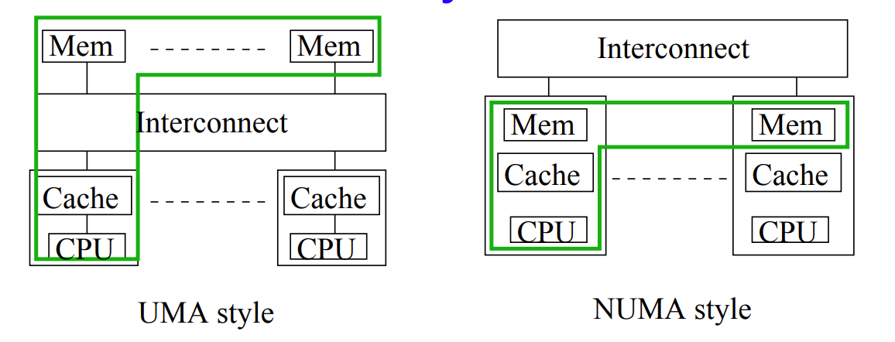
   1. UMA style: Uniform Memory Access architectures have all memory "equidistant" from all CPUs. 
   2. NUMA style: Non-UMA performance varies with data location. It is also called ***Distributed Shared Memory*** because memory is physically distributed but logically shared. 

6. Memory consistency
   1. Caches improve performance, but raise a memory consistency challenge: in what order should *updates* to memory made by one processor become *visible to others*. 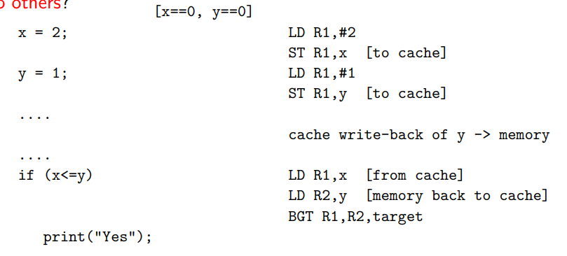. In this case, the processor sees x==2, y==1, however in the main memory x==0, y==1
   2. What and when it is permissible for each processor to see is defined by the ***consistency model***. 

7. Consistency model: A effective contract between hardware and software, must be respected by *programmers, compilers and library writers. Different consistency models trade off <u>conceptual simplicity</u> against <u>time/hardware complexity cost</u>. 
   1. Sequential consistency: every processor sees the same sequential interleaving of the basic reads and writes. It is intuitive but <span style="color:red">expensive to implement</span>. 
   2. Release consistency: writes are only guaranteed to be visible after program-specified synchronization points (triggered by special machine instructions)Even the ordering as written by one processor between such points may be seen differently by other processors. It is less intuitive but enables <span style="color:red">faster implementations. </span>

8. Ping-pong effects: the unit of transfer between memory and cache is a cache-line or block, containing several words. <span style="color:red">False sharing</span> occurs when two logically unconnected variables share the same cache-line. Updates to one cause remote copies of the line, including the other variable to be invalidated, creating very expensive, but semantically undetectable, "ping-pong" effects. 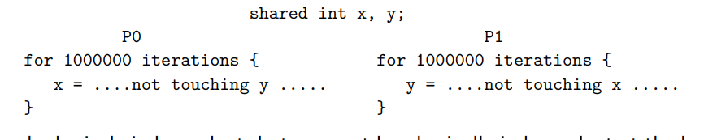. If x and y are located side by side, they may share the same cache-line

9. Multiconputer Architectures
   1.  Eahc processor only accesses its own physical address space, so no consistency issues. information is shared by explicit, co-operative message passing. 
   2.  Performance/correctness issues include the semantics of synchronization and constraints on message ordering. 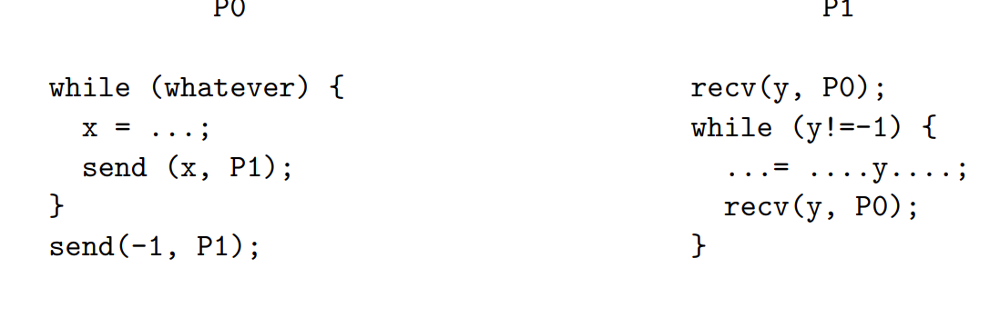 In this case the order of messages might not be the same as sending. For example, sending 3, 7, 2, -1 may the received in the ordered of 3, 7, -1, 2, which cause P1 fail to receive 2. 

## Lecture2 Notation
1. Three well-known patterns: 
   1. Bag of tasks
   2. Pipeline
   3. Interacting peers

2. Notation is not a real programming language, just a concise way of expressing what we need mechanisms to say in real languages and libraries. 

3. CO notation
   1. Use a pair "co" and "oc" to enclose a block
   2. Indicates creation of a set of activities, for the duration of the enclosed block, with synchronization across all activities at the end of the block. 
   3. Also called "fork-join" parallelism. ` 
   4. Use "//" to separate each statement. 

4. Sequential memory consistence (SC)
   1. Ordering of atomic actions (particularly reads and writes to memory) from any one thread have to occur in normal program order. 
   2. Atomic actions from different threads are interleaved arbitrarily (i.e. in an unpredictable sequential order, subject only to rule 1), with every thread seeing the same order. 
   3. SC execution is like a random stitch, allowing processes to access memory one at a time. 

5. Examples of SC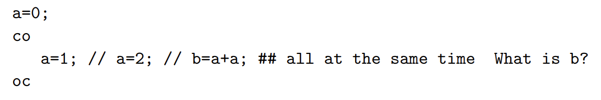
   1. In this cases b can be 0, 1, 2, 3, 4
   2. each single read or write is considered as an atomic action. 
   3. A possible order is: b reads a(0), a is set to 2, b reads a(2), ......, b=0+2=2

6. Atomic notation
   1. A pair of "<" and ">"
   2. Make the enclosed statements an atomic action
   3. For the above example, b can then be 0, 2, 4
   4. ```
      co
         count++; // count++;
      oc
      ```
      In this example, count++ consists of three steps (read, computer, write). What we actually mean is 
      ```
      co
         <count++;> // <count++;>
      oc
      ```
   5. ```
      co [i = 0 to n-1]
         a[i] = a[n-i-1]; ##try to reverse a in parallel
      oc
      ```
      It can work in conditions: 
      1. all reads are executed before writes. 
      2. Every two elements to be swaped are equal. 
      However, add an atomic notation makes it worse because the first condition won't work. 

7. Await Notation
   1. < await (B) S >. The atomic notation is required. It means S must be delayed until B is true within the same atomic action as a successful check of B. 
   2. S is not necessarily executed immediately B becomes true. Other threads can get executed, and B can be false again. In this case S should still be waiting. 
   3. <div>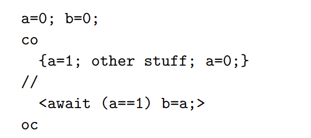</div>
      1. Can terminate: a=1, b=a, a=0. <br>
      2. Can fail to terminate: a=1, a=0, then thread 2 will wait forever. 

## Lecture3 Implementation of Patterns
1. Divide and Conquer problem can be computed concurrently because every sub-problem is independent, recursive calls don't interface with each other and can be computed by a thread separately. 
   ```
      co 
         larea = quad(left, mid, fleft, fmid, larea);
         //
         rarea = quad(mid, right, fmid, fright, rarea);
      oc
   ```

2. The Bag of Tasks Pattern
   1. 在典型系统中，创建或是规划一个线程的成本非常高，程序可能会被这种成本淹没
   2. Consists of：
      1. a fixed number of worker processes/threads
      2. a dynamic collection of homogeneous tasks
      3. Execution of a task can lead to the creation of more task instances
   3. 实现逻辑：
      ```
         co [w = 1 to p] {
            while(all tasks not done) {
               get a task; 
               execute the task; 
               possibly add new tasks to the bag; 
            }
         }
      ```
   4. This pattern is natually load-balanced: 每个worker(process/thread)完成不同数量的任务，但是大概差不多
   5. Example Program
      ```
         shared int size = 1, idle = 0; #size: 现在bag里的task个数 idle: not active的thread个数
         shared double totle = 0.0; 
         bar.insert (a, b, f(a), f(b), approxarea);
         co [w = 1 to p] {
            while (true) {
               < idle++; > # 每创建一个线程就idle+1
               < await (size > 0 || idle == P )
                  if (size > 0) {
                     bag.remove (left, right ...); size--; idle--; #有任务就取一个任务
                  } else break; > # 进程全部闲着并且没有task说明任务结束了
               mid = (left + right) / 2; ...etc...
               if (fabs (larea + rarea -lrarea) > EPSILON) {
                  < bag.insert (left, mid, fleft, fmid, larea); 
                    bag.insert (mid, right, fmid, fright, rarea); 
                    size = size + 2; >
               } else < total = total + larea + rarea; >
            }
         }
      ```
   6. Implementation of bag
      1. The challenge is to amake accessing the bag much cheaper that creating a new thread. With a shared address space, a simple implementation would make the bag an atomically accessed shared data structure. 
      2. A more sophisticated (with less contention) might internally have a collection of bags, perhaps one per worker, with task-stealing to distribute the load as necessary. 每个线程有自己的bag，然后从别的bag偷task

3. Pipeline Pattern
   1. Sieve of Eratosthenes: 找2~N中的质数。每次把剩余的最小数的倍数删除。每一步之前剩余的最小数都是质数。 
   2. Pipelines are composed of <span style="color:red">a sequence of producer-consumer relations</span> in which each consumer (except the last) becomes a producer for a further consumer. 
   3. 数据流是单向的，永远从producer流向consumer
   4. Programming challenge
      1. 要保证在consumer调用一块buffer之前，producer不能overwrite它
      2. No consumer尝试调用不存在的buffer或者re-use an already consumed entry
   5. Implementation (need for various facilities):
      1. A buffer in shared address space (need atomic actions and condition synchronization (await)) <br> 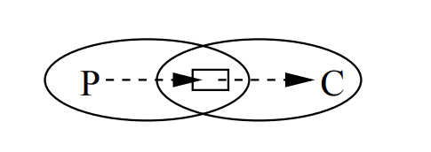
      2. In distributed implementation, avoid tight synchronization between sends to the buffer and receives from it <br>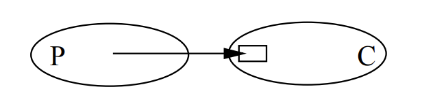

4. The Interacting Peers Pattern
   1. Information is exchanged in both direction within a multidimensional <span style="color: red">fixed structure</span>
   2. All processes execute more or less the <span style="color: red">same node</span>, but on <span style="color: red">distince partitions of the data</span> (also called **SPMD**. i.e., **Single Program Multiple Data**)
   3. 通常没有 "master", "root", or "controller" process, 除了开头或是结尾distribute and gather data and results. 
   4. Interaction can be through messages or shared variables. 
   5. Implementation:
      1. In shared variable version, use a duplicate grid and barriers to enforce correct synchronization between iterations (barrier ensures all threads reach the statement)
      ```
         shared real grid[n+2, n+2], newgrid[n+2. n+2]; 
         shared bool converged; local real diff; 
         co [i = 1 to n, j = 1 to n] {
            initialise grid;  # initialise duplicate grid for each thread
            do {
               barrier(); # before resetting test
               converged = true; 
               newgrid[i, j] = (new value)
               diff = abs (newgrid[i, j] - grid[i, j]); 
               barrier(); # before converge update
               if (diff > EPSILON) converged = false; 
               grid[i, j] = newgrid[i, j]; 
               barrier();            
            } while (not converged)
         }
      ```
      2. In message passing version, we remove the barriers and synchronize "natually" with local synchronous messages only. 

5. Other patterns
   1. MapReduce (championed by Google)
   2. Scan
   3. Divide & conquer
   4. Farm

6. Programming models try to support patterns (through polymorphic library operations)
   1. C++ Threading Building Blocks
   2. Microsoft's Task Parallel Library
   3. the Skandium Java Library

## Lecture4 Shared Variable Programming
1. Two fundamental kinds of sunchronization
   1. Mutual Exclusion: More like anti-synchronization. Prevent two or more threads from being active concurrently for the same period. 例如对同一个变量的写入遵循mutual exclusion
   2. Condition Synchronization: 延迟某个action直到某个条件被满足。(On the shared variables such as in producer-consumer, or with respect to the progress of other threads such as in barrier)

2. Critical Section: At most one thread is executing statements from the critical section at a time (because of potentially unsafe access to shared variables.)

3. <span style="color:red">Important properties</span>. The first three are always essential. Eventual entry may not matter in some performanceparallel system, as long as we are making progress elsewhere
   1. Mutual Exclusion: at most one thread is executing the critical section at a time
   2. Absence of Deadlock (Livelock): If two or more threads are trying to enter the critical section, at least one succeeds. 
   3. Absence of unnecessary delay: 当别的线程在non-critical section或者已经terminate, 尝试进入critical section的线程不该被阻止
   4. Eventual Entry (No starvation): A thread attempting to enter its critical section will eventually succeed

4. Locks: A shared variable to lock critical section. If the variable has value false then one locking thread can set it and proceed. Other attempted locks must be forced to wait. Following locks fail because statements can interleave. 
   ```
      co [i = 1 to n] {
         while (something) {
            < await (!l) l = true; >
            critical section; 
            unlock(l);
            non-critical section;
         }
      }
   ```

5. Implementing locks
   1. We rely on <span style="color:red">simpler atomic primitive</span>,implemented with hardware support. 
   2. Possibilities include "Fetch-and-Add", "Test-and-Set" and "Load-Linked,Store-Conditional" pairing
   3. <span style="color: red">Spin lock</span>: ensures mutual exclusion but not eventual entry
      ```
         lock_t l = false
         co [i = 1 to n] {
            while (something) {
               while (TS(l)) ; # spin
               critical section; 
               l = false; 
               non-critical section;  
            }
         }
      ```
   4. <span style="color: red">Test-and-Test-and-Set</span>: Simple spin lock don't make good use of the cache (TS play havoc with contention and coherence performance)
      ```
         lock_t l = false
         co [i = 1 to n] {
            while (something) {
               do {
                  while (l); # spin until lock seems free
               } while (TS(l)) ; # actual atomic locking
               critical section; 
               l = false; 
               non-critical section;  
            }
         }
      ```
      It can be simplifid as: 
      ```
         lock_t l = false
         co [i = 1 to n] {
            while (something) {
               while (l || TS(l)) ; # only TS while l was false
               critical section; 
               l = false; 
               non-critical section;  
            }
         }
      ```

6. Test-and-Set (TS)
   1. A <span style="color:red">A single machine instruction</span>
   2. Behave like a call-by-reference function, so that the variable passed in its read from and written to
   3. the key feature is that this happens <span style="color: red">atomically</span>

## Lecture5 Lamport's Bakery Algorithm
1. Lamport's Bakery Algorithm
   1. It uses only <span style="color: red">simple atomic read and simple atomic write instructions</span>, i.e., no need for atomic read-modify-write. 
   2. There are two phases to the entry protocal: 
      1. A thread calculates when its turn will be (as an integer), by looking at other threads' turns. A thread sets its turn to be one more that any other turn currently claimed. Threads not at the critical section have a turn of . 
      2. Secondly, the thread waits until its turn, by waiting until it has a lower turn than each of the other competing threads. 

2. Implementation of Lamport's Bakery Algorithm
   ```
      int turn[n] = [0, 0, ... , 0] # A shared array
      co [i = 1 to n] { # n is the number of threads gonna access the critical section
         while (true) {
            < turn[i] = max (turn[1..n] + 1; > 
            for (j = 1 to n except i) {
               < await (turn[j]==0 or turn[i] < turn[j]); >
            }
            critical section; 
            turn[i] = 0; 
            noncritical section; 
         }
      }
   ```
   But we want to drop the atomic section. Potential problems (without atomic): 
   1. There is a possibility that a thread can claim a lower turn than another thread which enters the critical section before it. 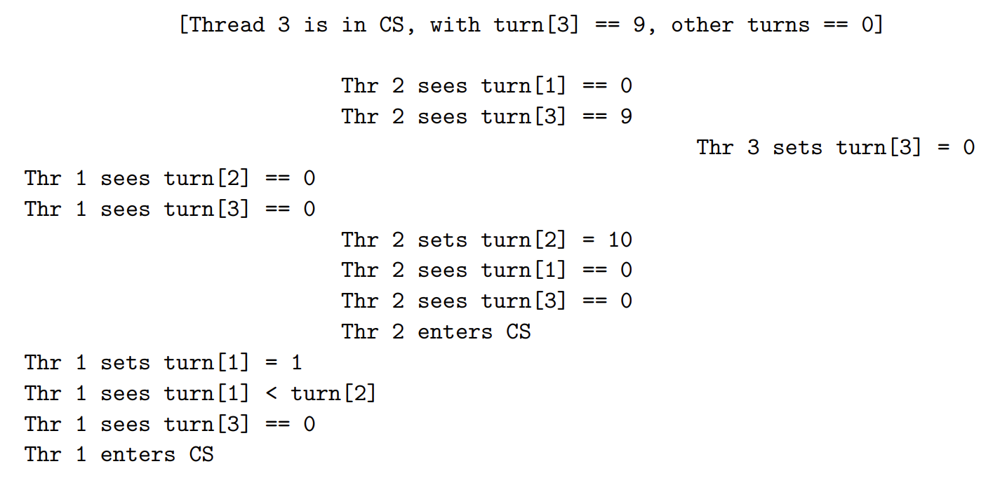Then both thread 1 and 2 are in the CS. 
   2. Two threads can have the same turn. 

3. Fix of implementation without atomic
   1. The first problem can be fixed by adding the statement turn[i] = 1. It distinguish the thread from those which are not attempting to enter the critical section. <span style="color: red">Notice: </span>now no thread will have the real turn value 1
   ```
      int turn[n] = [0, 0, ... , 0] # A shared array
      co [i = 1 to n] { # n is the number of threads gonna access the critical section
         while (true) {
            turn[i] = 1; turn[i] = max (turn[1..n] + 1;  # Fix
            for (j = 1 to n except i) {
               while ((turn[j] != 0) and (turn[i] > turn[j])) skip; 
            }
            critical section; 
            turn[i] = 0; 
            noncritical section; 
         }
      }
   ```
   2. The second problem can be solved by handling equal turns artificially. We use the thread ids and in the lower id wins if two turns are equal. 
   ```
      int turn[n] = [0, 0, ... , 0] # A shared array
      co [i = 1 to n] { # n is the number of threads gonna access the critical section
         while (true) {
            turn[i] = 1; turn[i] = max (turn[1..n] + 1;  # Fix
            for (j = 1 to n except i) {
               while (turn[j] != 0 and (turn[i], i) > (turn[j], j)) skip; 
            }
            critical section; 
            turn[i] = 0; 
            noncritical section; 
         }
      }
   ```

## Lecture6 Barriers
1. Definition: Wait for other workers to get there. Called <span style="color: red">barrier synchronization</span>

2. Counter barrier
   1. It is <u>single use</u>
   2. Implementation
   ```
   shared int count = 0; 
   co [i = 1 to n] {
      do some work; 
      < count = count + 1 >
      < await (count == n); >
   }
   ```
   3. But we want reusable barriers, but this implementation is wrong because when count is set to 0 other workers will wait forever. 

3. Sense Reversing Barrier
   1. This is a correct counter barrier
   2. Implementation. 每一轮sense作为一个flag
   ```
   shared int count = 0; shared boolean sense = false;
   co [i = 1 to n] {
      private boolean mySense = !sense; # one per thread
      while (something) {
         do some work; 
         < count = count + 1;
            if (count == n) { count = 0; sense = mySense;}
      }
      while (sense != mySense); # wait
      mySense = !mySense
   }
   ```
   3. Basic idea
      1. The value of **sense** <span style="color: red">flips</span> each iteration. It indicates whether threads can proceed. 
      2. mySense is a local variable and decide whether match sense and can proceed. 
      3. The key idea it that we ve <span style="color: red">separated the signal</span> that the barrier has been completed (flipping sense) from the <span style="color: red">mechanism used to determine</span> the condition, count
      4. Flipping the binary value sense simultaneously prepare the barrier for the next iteration. 

4. Symmetric barriers
   1. It is designed to avoid the bottleneck at the counter (?)
   2. Overall sunchronization is achieved transitively from a <span style="color: red">carefully chosen sequence of pairwise synchronizations. Each thread executes the same code, </span>choosing partners for the pairwise cynchs as a function of its own identifier and the internal iteration. For n a power of 2, we have the <span style="color: red">bufferfly pattern. </span>Each line means a sychronized barrier between them. 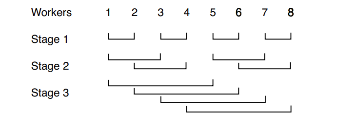
   3. Implementation: 
   ```
   < await (arrive[myid] == 0); >
   arrive[myid] = 1; 
   < await (arrive[friend] == 1); >
   arrive[friend] = 0; 
   ```
   4. Problem: If 1 arrives in the stage 1 but 2 never arrives and 3 has entered stage 2, it sees 1 has arrived and the synchronization is broken. 
   5. Potential fix (proposed by bared man): instead of binary value, set the value to its friend id. 
   6. Another fix: by having distinct variables for each stage of the barrier
   ```
   for [s = 0 to stages-1] {
      < await (arrive[myid][s] == 0); >
      arrive[myid][s] = 1; 
      work out who my friend is at this stage; 
      < await (arrive[friend][s] == 1); > 
      arrive[friend][s] = 0;
   }
   ```

5. Dissemination barriers
   1. What if n is not a power of 2? <span style="color: red">dissemination barrier is a similar approach to symmetric barrier</span>. 
   2. We have two partners at eac stage, one incoming and one outgoing

## Lecture7 Structure Primitives
1. Structure Primitives: The mechanisms we have implemented <span style="color: red">with the assitance of the operating system</span>, so that threads can be directly suspended and resumed. The most common two are <span style="color: red">semaphores</span> and <span style="color: red">monitors</span>. 

2. Semaphores
   1. It is a special shared variable, accessible only through two atomic operations, <span style="color: red">P and V</span>, defined by: 
      1. P(s): < await (s>0) s=s-1 >
      2. V(s): < s=s+1; >
   2. A semaphore only taking binary values is called as <span style="color: red">binary semaphore</span> (just a way of using it, not a type)
   3. It provides a solution to the critical secion problem
   ```
   sem mutex = 1;

   co [i = 1 to n] {
      while (whatever) {
         P(mutex); 
         CS; 
         V(mutex); 
         non-CS; 
      }
   }
   ```
   4. We can also use semaphores at the core of a symmetric barrier implementation (in which we have an array of arrive semaphores for each stage). With it we <span style="color: red">no longer need the initial wait</span> for semaphore to be zeroed. 
   ```
   for [s = 1 to stages] {
      V(arrive[myid][s]); 
      work out who my friend 
   }
   ```
   5. Porvide solution to producer-consumer buffering problems
      1. For example, to control access to a simgle element buffer, we can use two semaphores, <span style="color: red">one indicating that the buffer is full, the other to indicate that it is empty. </span>
      2. Since only one of the semaphores will ever have the value one, this is sometimes called a <span style="color: red">split binary semaphore</span>
      3. More generally a semaphore whose value is counting the availability of some resource, is often called a <span style="color: red">counting semaphore</span> (sometimes split)
      ```
      T buf; sem empty = 1, full = 0; 
      co
         co [i = 1 to M] {
            while (whatever) {
               # produce data locally
               P(empty); 
               buf = data; 
               V(full); 
            }
         }
         //
         co [j = 1 to N] {
            while (whatever) {
               P(full); 
               result = buf; 
               V(empty); 
               # handle result locally
            }
         }
      oc
      ```
   6. Bounded buffer
      1. It is implemented with an array and two integer indices, indicating the current <span style="color: red">front and read</span> of the buffer and use arithmetic modulo n. 
      2. Provided the buffer is not empty or full, we should <span style="color: red">allow producer and consumer to be active within it simultaneously. </span>
      3. Implementation:
      ```
      T buf; int front = 0, rear = 0; 
      sem empty = n, full = 0; 
      co
         co [i = 1 to M] {
            while (whatever) {
               # produce data locally
               P(empty); 
               buf[rear] = data; rear = (rear + 1) % n; 
               V(full); 
            }
         }
         //
         co [j = 1 to N] {
            while (whatever) {
               P(full); 
               result = buf[front];  front = (front + 1) % n
               V(empty); 
               # handle result locally
            }
         }
      oc
      ```
      4. For multiple producers/consumers, we need to level of protection. We use a <span style="color: red">split counting semaphore</span> to avoid buffer overflow. We use a <span style="color: red">mutual exclusion semaphore</span> to prevent interference between producers and another for consumers. This allows <span style="color: red">up to one consumer and one producer to be actively simultaneously</span> within a non-empty and non full buffer. 
      ```
      T buf; int front = 0, rear = 0; 
      sem empty = n, full = 0, mutexP = 1, mutexC = 1; 
      co
         co [i = 1 to M] {
            while (whatever) {
               # produce data locally
               P(empty); 
                  P(mutexP); buf[rear] = data; rear = (rear + 1) % n; V(mutexP)
               V(full); 
            }
         }
         //
         co [j = 1 to N] {
            while (whatever) {
               P(full); 
                  P(mutexC); result = buf[front];  front = (front + 1) % n;  V(mutexP)
               V(empty); 
               # handle result locally
            }
         }
      oc
      ```
      5. To allow <span style="color: red">several</span> producers and consumers simultaneously, following solution is proposed. However, if the second producer is ready first, the consumer tries to get front, but front is not ready yet. 
      ```
      T buf; int front = 0, rear = 0; 
      sem empty = n, full = 0, mutexP = 1, mutexC = 1; 
      co
         co [i = 1 to M] {
            while (whatever) {
               # produce data locally
               P(empty); 
                  P(mutexP); myrear = rear; buf[rear] = data; rear = (rear + 1) % n; V(mutexP); 
                  buf[myrear] = data; 
               V(full); 
            }
         }
         //
         co [j = 1 to N] {
            while (whatever) {
               P(full); 
                  P(mutexC); myfront = front; front = (front + 1) % n;  V(mutexP)
                  result = buf[front]; 
               V(empty); 
               # handle result locally
            }
         }
      oc
      ```

## Lecture8 Monitors
1. Drawbacks of semaphores
   1. They require careful programming: there is no explicit connection in the program source between matching semaphore operations. 
   2. There is no obvious indication of how semaphores are being used. Confusion is possible. 

2. Monitors - Mutual exclusion: 
   1. It is like an object (class) which encapsulates some data to which access is only permitted through a set of methods. 
   2. At most one thread is active within the monitor at any one time (though many threads may be suspended within monitor methods)
   3. Each monitor method is <span style="color: red">implicitly</span> surrounded with P() and V() operations on a single hidden binary semaphore, shared by all methods. 
   4. It provides structured mutual exclusion implicitly. More complex conditional synchronization requires explicit actions by the program. 

3. Monitors - Condition Synchronization
   1. <span style="color: red">Condition variable</span> is a special variable, associated with a monitor, which we can think of as controlling a queue of delayed threads. 
   2. <span style="color: red">Once inside a monitor method</span> a thread may call the wait(cv) operation, where cv is a condition variable. This causes the thread both to <span style="color: red">give up the (implicit) lock</span> it holds on the monitor, and to be <span style="color: red">blocked upon the queue</span> of cv. 
   3. A blocked thrad remains so until some other thread, while active inside the monitor, calls the operation <span style="color: red">signal(cv) </span>This causes a previously blocked thread (normally chosen by a <span style="color: red">FIFO discipline</span>) tp <span style="color: red">become ready for rescheduling</span>. (ie it becomes  blocked on the implicit lock, waiting for this to be released). 
   4. The signalling thread continues uninterrupted, hence this scheme is called <span style="color: red">signal and continue (SC)</span>.
   5. State diagram of SC. M.op() means deposit or fetch. Theoretically it does not guarantee eventual entry, but in practice it does. Operating system operates the queue. 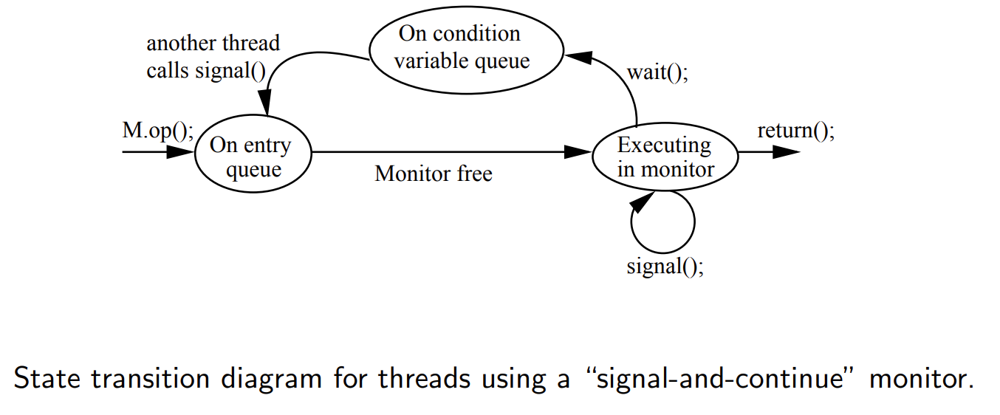
   6. An operation <span style="color: red">signal-all</span> is usually available, awakening <span style="color: red">all</span> waiting threads. All threas are then eligible to proceed and once the signalling thread releases the lock, only one thread will be allowed into the monitor. 
   7. signal() on a variable variable is <span style="color: red">not remembered</span>, in the wat that V() on a semaphore is. If no threads are waiting, then a signal() is lost, thereas a V() will allow a subsequent P() to proceed. 
   8. When signal happens, the signalled thread is just <span style="color: red">available</span>. Other threads coming first can negate its condition and prevent it from procededing. 
   9. Thus it is often necessary, in all but the most tightly constrained situations, to wrap each condition variable wait() call in a loop which rechecks the condition. 
   10. Implementation for many producers and consumenrs. 
   ```
   monitor Bounded_Buffer {
      typeT buf[n]; # the buffer
      int front = 0,   # index of the first full slot
          rear = 0,    # index of the first empty slot
          count = 0; 
         # rear == (front + count) % n
      cond not_full,   # signalled when count < n
           not_empty;  # sigballed when count > 0

      procedure deposit(typeT data) {
         while (count == n) wait(not_full); 
         buf[rear] = data; rear = (rear + 1) % n; count++; 
         signal(not_empty); 
      }

      procedure fetch(typeT data) {
         while (count == 0) wait(not_empty); 
         result = buf[front]; front = (front + 1) % n; count--; 
         signal(not_efull); 
      }
   }
   ```